# 前端学习

## HTML-CSS

### Vscode开发工具

meta标签

> <meta> 是 HTML 中的一个元数据标签，用于提供关于 HTML 文档的元信息，这些信息不会直接显示在页面上，但对于浏览器和搜索引擎等工具来说非常重要。<meta> 标签通常位于 HTML 文档的 <head> 部分。

代码

```html
<!DOCTYPE html>
<html lang="en">
<head>
    <!-- 字符集 -->
    <meta charset="UTF-8">
    <!-- 在移动设备的显示和缩放比例 -->
    <meta name="viewport" content="width=device-width, initial-scale=1.0">
    <title>Document</title>
</head>
   <body>
        <h1>Html快速入门</h1>
        <!-- alt描述,width,height设置长宽 -->
        
        <h1>我是一级标题</h1>
   </body>
</html>
```

### 常见标签和样式-央视新闻-标题-排版

html在渲染时，从上往下逐行解析展示的

**只有h1-h6没有多余的**

### 常见标签和样式-央视新闻-标题-样式

#### CSS 引入方式

- **行内样式**：写在标签的`style`属性中（配合 JavaScript 使用）
- **内部样式**：写在`<style>`标签中（可以写在页面任何位置，但通常约定写在`<head>`标签中）
- **外部样式**：写在一个单独的`.css`文件中（需要通过`<link>`标签在网页中引入）

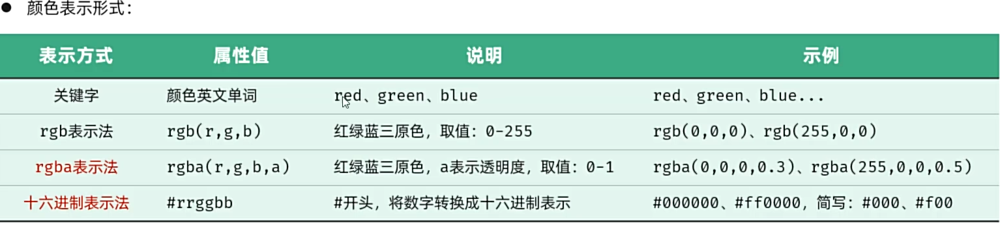

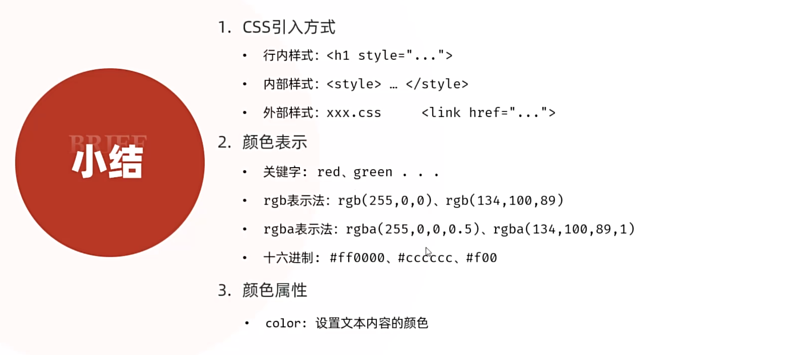

### 常见标签和样式-央视新闻-标题-样式(选择器)

> CSS选择器是用来选取需要设置样式的元素(标签)的

| 选择器     | 写法                | 示例       | 示例说明                               |
| ---------- | ------------------- | ---------- | -------------------------------------- |
| **元素选择器** | 元素名称 {...}      | h1 {...}   | 选择页面上所有的<h1>标签               |
| **类选择器** | .class 属性值 {...} | .cls {...} | 选择页面上所有 class 属性为 cls 的标签 |
| **id 选择器** | #id 属性值 {...}    | #hid {...} | 选择页面上 id 属性为 hid 的标签        |
|分组选择器|选择器1,选择器2 {...}|h1,h2 {...}|选择页面上所有的<h1>和<h2>标签|
|属性选择器|元素名称[属性] {...}|input[type] {...}|选择页面上有type属性的<input>标签|
|属性选择器|元素名称[属性名="值"] {...}|input[type="text"] {...}|选择页面上type属性为text的<input>标签|
|后代选择器|元素1 元素2 {...}|form input {...}|选择<form>标签内的所有<input>标签|

### 常见标签和样式-央视新闻-正文-排版

代码

```html
<!DOCTYPE html>
<html lang="en">
    <head>
        <meta charset="UTF-8">
        <meta name="viewport" content="width=device-width, initial-scale=1.0">
        <title>【新思想引领新征程】推进长江十年禁渔 谱写长江大保护新篇章</title>
        <style>
          #time{
            color: #b2b2b2;
          }    
          a{
            /* 去除超链接下的下划线 */
            text-decoration:none;
          }
        </style>
        <!-- 方式3：外部样式 -->
        <!-- <link rel="stylesheet" href="./css/news.css"> -->
    </head>
    <body>
        <!--  -------------------新闻标题-------------------- -->
        <h1>【新思想引领新征程】推进长江十年禁渔 谱写长江大保护新篇章</h1>
      
        <a href="https://www.cctv.com" target="_blank" >央视网</a> 
        <!-- 发布时间 -->
        <span id="time">2024年05月15日 20:07</span>
        <br>
        <!--  -------------------新闻主体-------------------- -->
        <!-- 引入一个视频,路径为./video/video.mp4,controls表示显示控件-->
         <!-- video标签属性
          src-视频路径
          controls-显示控件
          autoplay-自动播放
          width-宽度
          height-高度,建议只设置一个,另一个会自动适应
            px：像素
            百分比：相对于父元素的宽度
            自动：根据视频的宽度自动调整
          loop-循环播放
          poster-封面图片
          muted-静音
          preload-预加载
         -->
        <video src="./video/news.mp4" controls width="80%"></video>
        <!-- <audio src="./audio/news_1739964534813.mp3" controls></audio> -->
        <p>央视网消息（新闻联播）：作为共抓长江大保护的标志性工程，长江十年禁渔今年进入第四年。习近平总书记指出，长江禁渔是为全局计、为子孙谋的重要决策。牢记总书记嘱托，沿江省市持续推进长江水生生物多样性恢复，努力保障退捕渔民就业生活。这段时间，记者深入长江两岸，记录下禁渔工作取得的重要阶段性成效和广大干部群众坚定不移推进长江十年禁渔的扎实行动。</p>
        <p>行走在长江沿线，科研人员发现很多可喜现象。</p>
        <!-- 引入一张gif，在./Picture目录下 -->
        <!-- img标签属性
        src-访问路径
        1.绝对路径
          1.1绝对磁盘路径:C:\Users\Administrator\Desktop\Study\Picture\1_1739964534896.gif
          1.2绝对网络路径:https://www.baidu.com/img/bd_logo1.png
        2.相对路径
          2.1./表示当前目录(可以省略)
          2.2../表示上一级目录
         
        alt-图片描述
        width-宽度
        height-高度,建议只设置一个,另一个会自动适应
        px：像素
        百分比：相对于父元素的宽度
        自动：根据图片的宽度自动调整 -->
        </img>
        <p>在长江南源，一处小头裸裂尻鱼新的栖息地被发现，鱼的数量大约超3万尾，为水生态保护提供了珍贵数据。</p>
        <br>
        <p>在长江中游，追踪显示，人工增殖放流的中华鲟成功入海率已经从45%左右提升至60%以上；鄱阳湖鱼类小型化、低龄化趋势得到遏制，栖息地生存环境得以改善。</p>
        <br>
        <p>在长江下游，今年3月起，南京秦淮河入江口首次出现野生中华绒螯蟹大规模洄游现象，种群数量明显增加。</p>
        
        
        <p>水生生物资源恢复向好，见证了长江十年禁渔三年多来的阶段性成果。</p>
        <br>
        <p>实施长江十年禁渔，是以习近平同志为核心的党中央从中华民族长远利益出发作出的重要决策。党的十八大以来，总书记多次深入长江沿线考察调研，详细了解长江十年禁渔的实施情况，他指出，要坚定推进长江十年禁渔，巩固好已经取得的成果。</p>
        
        
        <p>按照部署，自2021年1月1日起，在长江干流、大型通江湖泊、重要支流和长江口部分海域实行为期十年的禁渔，常年禁止天然渔业资源的生产性捕捞。禁渔三年多来，相关评估显示，长江干流和鄱阳湖、洞庭湖水生生物完整性指数由禁渔前最差的“无鱼”提升了两个等级。2022年，长江江豚数量达到1249头，实现历史性止跌回升。长江干流水质连续4年全线保持Ⅱ类。</p>
        <br>
        <p>实施长江十年禁渔，解决好渔民上岸后的生产生活问题，禁渔才有稳定扎实的社会基础。</p>
        
        
        <p>安徽退捕转产的3万多名渔民，在政府的引导下接受就业培训。在当涂县，免费学习养殖技术，养殖生态螃蟹成了退捕渔民的新选择。</p>
        <br>
        <p>在拥有洞庭湖超六成水域的湖南岳阳，政府帮扶上岸渔民建起养殖场，发展风干鱼产业，还带领他们学习直播带货，拓宽销路。</p>
        <br>
        <p>在渔民退捕上岸的鄱阳湖棠荫岛，当地在继续保护好生态的前提下，正探索规划利用独特的自然资源发展旅游产业。禁渔三年多来，有关部门对23.1万退捕渔民逐一建档立卡，多渠道提升就业、社保水平。</p>

        
        <p>长江十年禁渔实施以来，沿江省市合力攻坚、久久为功，长江大保护不断向纵深推进，持续巩固禁渔成果。下一步，沿江省市还将加强水生生物重要栖息地修复，建立退捕渔民动态精准帮扶服务，完善跨区域、跨部门执法合作机制，确保一江清水绵延后世、惠泽人民。</p>
    </body>
</html>
```

### 常见标签和样式-央视新闻-正文-样式

代码

```html
<!DOCTYPE html>
<html lang="en">
    <head>
        <meta charset="UTF-8">
        <meta name="viewport" content="width=device-width, initial-scale=1.0">
        <title>【新思想引领新征程】推进长江十年禁渔 谱写长江大保护新篇章</title>
        <style>
          #time{
            color: #b2b2b2;
          }    
          a{
            /* 去除超链接下的下划线 */
            text-decoration:none;
          }
          p{
            /* 首行缩进 */
            text-indent: 2em;
            /* 行高 */
            line-height: 2;/* 行高为字体大小的2倍 */
          }
        </style>
        <!-- 方式3：外部样式 -->
        <!-- <link rel="stylesheet" href="./css/news.css"> -->
    </head>
    <body>
        <!--  -------------------新闻标题-------------------- -->
        <h1>【新思想引领新征程】推进长江十年禁渔 谱写长江大保护新篇章</h1>
      
        <a href="https://www.cctv.com" target="_blank" >央视网</a> 
        <!-- 发布时间 -->
        <span id="time">2024年05月15日 20:07</span>
        <br>
        <!--  -------------------新闻主体-------------------- -->
        <!-- 引入一个视频,路径为./video/video.mp4,controls表示显示控件-->
         <!-- video标签属性
          src-视频路径
          controls-显示控件
          autoplay-自动播放
          width-宽度
          height-高度,建议只设置一个,另一个会自动适应
            px：像素
            百分比：相对于父元素的宽度
            自动：根据视频的宽度自动调整
          loop-循环播放
          poster-封面图片
          muted-静音
          preload-预加载
         -->
        <video src="./video/news.mp4" controls width="80%"></video>
        <!-- <audio src="./audio/news_1739964534813.mp3" controls></audio> -->
        <p><!-- &nbsp;表示一个空格字符 -->
          <b>央视网消息</b>
          （新闻联播）：作为共抓长江大保护的标志性工程，长江十年禁渔今年进入第四年。习近平总书记指出，长江禁渔是为全局计、为子孙谋的重要决策。牢记总书记嘱托，沿江省市持续推进长江水生生物多样性恢复，努力保障退捕渔民就业生活。这段时间，记者深入长江两岸，记录下禁渔工作取得的重要阶段性成效和广大干部群众坚定不移推进长江十年禁渔的扎实行动。
        </p>
        <p>行走在长江沿线，科研人员发现很多可喜现象。</p>
        <!-- 引入一张gif，在./Picture目录下 -->
        <!-- img标签属性
        src-访问路径
        1.绝对路径
          1.1绝对磁盘路径:C:\Users\Administrator\Desktop\Study\Picture\1_1739964534896.gif
          1.2绝对网络路径:https://www.baidu.com/img/bd_logo1.png
        2.相对路径
          2.1./表示当前目录(可以省略)
          2.2../表示上一级目录
         
        alt-图片描述
        width-宽度
        height-高度,建议只设置一个,另一个会自动适应
        px：像素
        百分比：相对于父元素的宽度
        自动：根据图片的宽度自动调整 -->
        </img>
        <p>在长江南源，一处小头裸裂尻鱼新的栖息地被发现，鱼的数量大约超3万尾，为水生态保护提供了珍贵数据。</p>
        <br>
        <p>在长江中游，追踪显示，人工增殖放流的中华鲟成功入海率已经从45%左右提升至60%以上；鄱阳湖鱼类小型化、低龄化趋势得到遏制，栖息地生存环境得以改善。</p>
        <br>
        <p>在长江下游，今年3月起，南京秦淮河入江口首次出现野生中华绒螯蟹大规模洄游现象，种群数量明显增加。</p>
        
        
        <p>水生生物资源恢复向好，见证了长江十年禁渔三年多来的阶段性成果。</p>
        <br>
        <p>实施长江十年禁渔，是以习近平同志为核心的党中央从中华民族长远利益出发作出的重要决策。党的十八大以来，总书记多次深入长江沿线考察调研，详细了解长江十年禁渔的实施情况，他指出，要坚定推进长江十年禁渔，巩固好已经取得的成果。</p>
        
        
        <p>按照部署，自2021年1月1日起，在长江干流、大型通江湖泊、重要支流和长江口部分海域实行为期十年的禁渔，常年禁止天然渔业资源的生产性捕捞。禁渔三年多来，相关评估显示，长江干流和鄱阳湖、洞庭湖水生生物完整性指数由禁渔前最差的“无鱼”提升了两个等级。2022年，长江江豚数量达到1249头，实现历史性止跌回升。长江干流水质连续4年全线保持Ⅱ类。</p>
        <br>
        <p>实施长江十年禁渔，解决好渔民上岸后的生产生活问题，禁渔才有稳定扎实的社会基础。</p>
        
        
        <p>安徽退捕转产的3万多名渔民，在政府的引导下接受就业培训。在当涂县，免费学习养殖技术，养殖生态螃蟹成了退捕渔民的新选择。</p>
        <br>
        <p>在拥有洞庭湖超六成水域的湖南岳阳，政府帮扶上岸渔民建起养殖场，发展风干鱼产业，还带领他们学习直播带货，拓宽销路。</p>
        <br>
        <p>在渔民退捕上岸的鄱阳湖棠荫岛，当地在继续保护好生态的前提下，正探索规划利用独特的自然资源发展旅游产业。禁渔三年多来，有关部门对23.1万退捕渔民逐一建档立卡，多渠道提升就业、社保水平。</p>

        
        <p>长江十年禁渔实施以来，沿江省市合力攻坚、久久为功，长江大保护不断向纵深推进，持续巩固禁渔成果。下一步，沿江省市还将加强水生生物重要栖息地修复，建立退捕渔民动态精准帮扶服务，完善跨区域、跨部门执法合作机制，确保一江清水绵延后世、惠泽人民。</p>
    </body>
</html> 
```

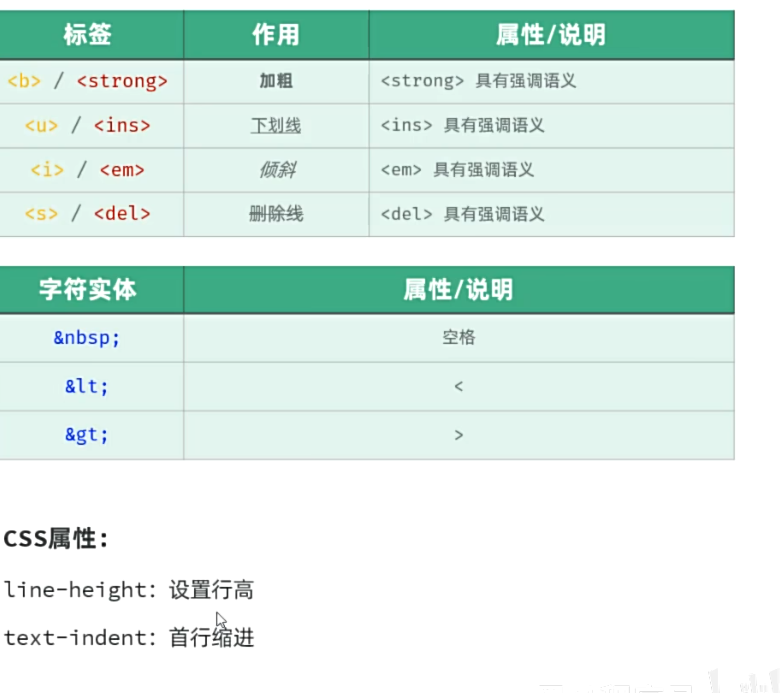

### 常见标签和样式-央视新闻-整体样式

代码

```html
<!DOCTYPE html>
<html lang="en">
    <head>
        <meta charset="UTF-8">
        <meta name="viewport" content="width=device-width, initial-scale=1.0">
        <title>【新思想引领新征程】推进长江十年禁渔 谱写长江大保护新篇章</title>
        <style>
          #time{
            color: #b2b2b2;
          }    
          a{
            /* 去除超链接下的下划线 */
            text-decoration:none;
          }
          p{
            /* 首行缩进 */
            text-indent: 2em;
            /* 行高 */
            line-height: 2;/* 行高为字体大小的2倍 */
          }
          #page{
            width: 70%;/* 上下外边距为0，左右外边距自动，实现居中显示 */
            margin-left: auto;
            margin-right: auto;
          }
        </style>
        <!-- 方式3：外部样式 -->
        <!-- <link rel="stylesheet" href="./css/news.css"> -->
    </head>
    <body>
      <div id="page">
       
        <!--  -------------------新闻标题-------------------- -->
        <h1>【新思想引领新征程】推进长江十年禁渔 谱写长江大保护新篇章</h1>
      
        <a href="https://www.cctv.com" target="_blank" >央视网</a> 
        <!-- 发布时间 -->
        <span id="time">2024年05月15日 20:07</span>
        <br>
        <!--  -------------------新闻主体-------------------- -->
        <!-- 引入一个视频,路径为./video/video.mp4,controls表示显示控件-->
         <!-- video标签属性
          src-视频路径
          controls-显示控件
          autoplay-自动播放
          width-宽度
          height-高度,建议只设置一个,另一个会自动适应
            px：像素
            百分比：相对于父元素的宽度
            自动：根据视频的宽度自动调整
          loop-循环播放
          poster-封面图片
          muted-静音
          preload-预加载
         -->
        <video src="./video/news.mp4" controls width="100%"></video>
        <!-- <audio src="./audio/news_1739964534813.mp3" controls></audio> -->
        <p><!-- &nbsp;表示一个空格字符 -->
          <b>央视网消息</b>
          （新闻联播）：作为共抓长江大保护的标志性工程，长江十年禁渔今年进入第四年。习近平总书记指出，长江禁渔是为全局计、为子孙谋的重要决策。牢记总书记嘱托，沿江省市持续推进长江水生生物多样性恢复，努力保障退捕渔民就业生活。这段时间，记者深入长江两岸，记录下禁渔工作取得的重要阶段性成效和广大干部群众坚定不移推进长江十年禁渔的扎实行动。
        </p>
        <p>行走在长江沿线，科研人员发现很多可喜现象。</p>
        <!-- 引入一张gif，在./Picture目录下 -->
        <!-- img标签属性
        src-访问路径
        1.绝对路径
          1.1绝对磁盘路径:C:\Users\Administrator\Desktop\Study\Picture\1_1739964534896.gif
          1.2绝对网络路径:https://www.baidu.com/img/bd_logo1.png
        2.相对路径
          2.1./表示当前目录(可以省略)
          2.2../表示上一级目录
         
        alt-图片描述
        width-宽度
        height-高度,建议只设置一个,另一个会自动适应
        px：像素
        百分比：相对于父元素的宽度
        自动：根据图片的宽度自动调整 -->
        </img>
        <p>在长江南源，一处小头裸裂尻鱼新的栖息地被发现，鱼的数量大约超3万尾，为水生态保护提供了珍贵数据。</p>
        <br>
        <p>在长江中游，追踪显示，人工增殖放流的中华鲟成功入海率已经从45%左右提升至60%以上；鄱阳湖鱼类小型化、低龄化趋势得到遏制，栖息地生存环境得以改善。</p>
        <br>
        <p>在长江下游，今年3月起，南京秦淮河入江口首次出现野生中华绒螯蟹大规模洄游现象，种群数量明显增加。</p>
        
        
        <p>水生生物资源恢复向好，见证了长江十年禁渔三年多来的阶段性成果。</p>
        <br>
        <p>实施长江十年禁渔，是以习近平同志为核心的党中央从中华民族长远利益出发作出的重要决策。党的十八大以来，总书记多次深入长江沿线考察调研，详细了解长江十年禁渔的实施情况，他指出，要坚定推进长江十年禁渔，巩固好已经取得的成果。</p>
        
        
        <p>按照部署，自2021年1月1日起，在长江干流、大型通江湖泊、重要支流和长江口部分海域实行为期十年的禁渔，常年禁止天然渔业资源的生产性捕捞。禁渔三年多来，相关评估显示，长江干流和鄱阳湖、洞庭湖水生生物完整性指数由禁渔前最差的“无鱼”提升了两个等级。2022年，长江江豚数量达到1249头，实现历史性止跌回升。长江干流水质连续4年全线保持Ⅱ类。</p>
        <br>
        <p>实施长江十年禁渔，解决好渔民上岸后的生产生活问题，禁渔才有稳定扎实的社会基础。</p>
        
        
        <p>安徽退捕转产的3万多名渔民，在政府的引导下接受就业培训。在当涂县，免费学习养殖技术，养殖生态螃蟹成了退捕渔民的新选择。</p>
        <br>
        <p>在拥有洞庭湖超六成水域的湖南岳阳，政府帮扶上岸渔民建起养殖场，发展风干鱼产业，还带领他们学习直播带货，拓宽销路。</p>
        <br>
        <p>在渔民退捕上岸的鄱阳湖棠荫岛，当地在继续保护好生态的前提下，正探索规划利用独特的自然资源发展旅游产业。禁渔三年多来，有关部门对23.1万退捕渔民逐一建档立卡，多渠道提升就业、社保水平。</p>

        
        <p>长江十年禁渔实施以来，沿江省市合力攻坚、久久为功，长江大保护不断向纵深推进，持续巩固禁渔成果。下一步，沿江省市还将加强水生生物重要栖息地修复，建立退捕渔民动态精准帮扶服务，完善跨区域、跨部门执法合作机制，确保一江清水绵延后世、惠泽人民。</p>
        </div>
      </body>
</html>
```

#### 盒子模型

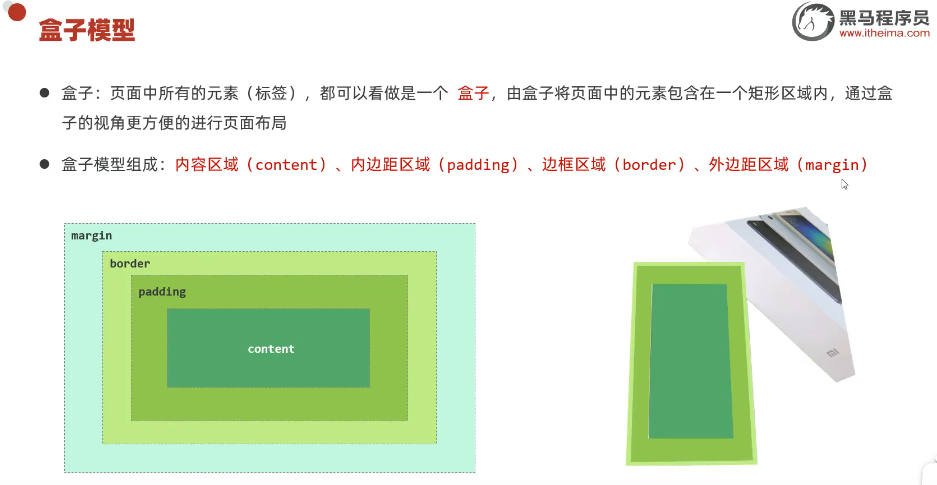

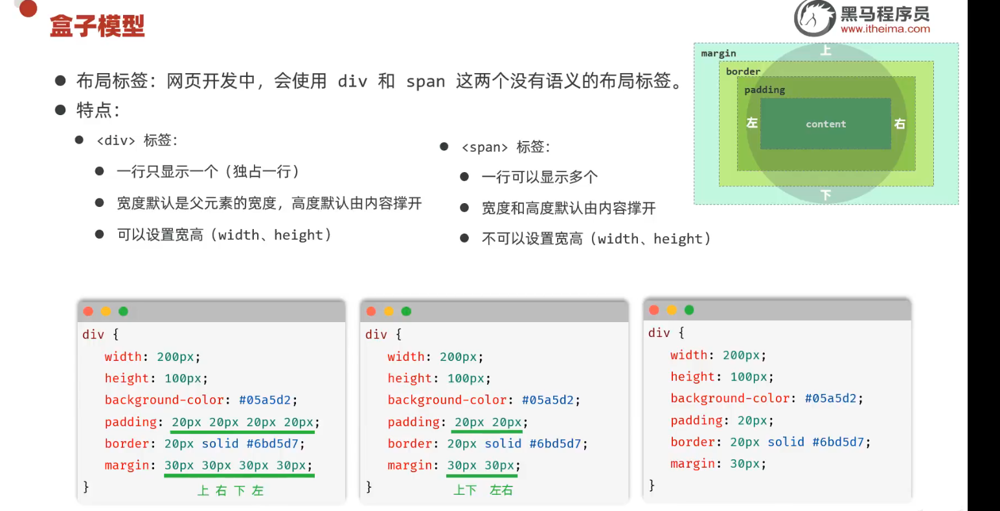

代码

```html
<!DOCTYPE html>
<html lang="en">
<head>
  <meta charset="UTF-8">
  <meta name="viewport" content="width=device-width, initial-scale=1.0">
  <title>Document</title>
  <style>
    #div1{
      width: 400px;/*默认是内容展示区域的宽度*/
      height: 400px;
      background-color: pink;
      padding: 30px;
      box-sizing: border-box;/*属性值改为这个就会让盒子外面变成400,300而不是内容显示区域*/
      /* 设置边框 */
      border: 10px solid red;
      /* 设置外边距 */
      margin: 30px auto; /*上下外边距为30,左右外边距自动,实现居中显示*/
    }
  </style>
</head>
<body>
    <div id="div1">
        A A A A A A A A A A A A A A A A
    </div>
</body>
</html>
```

效果:

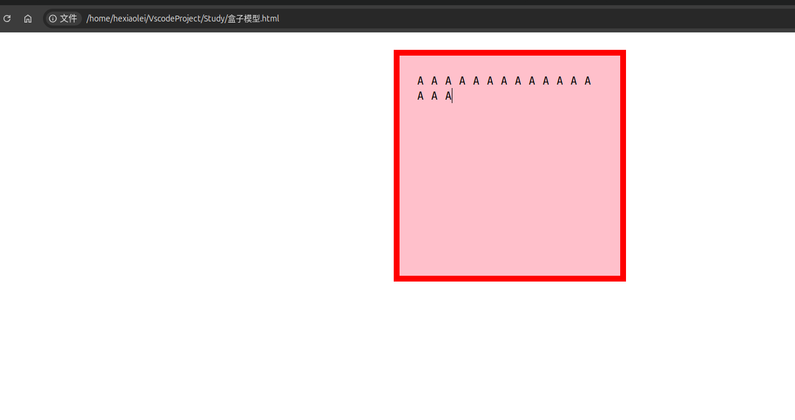

总结

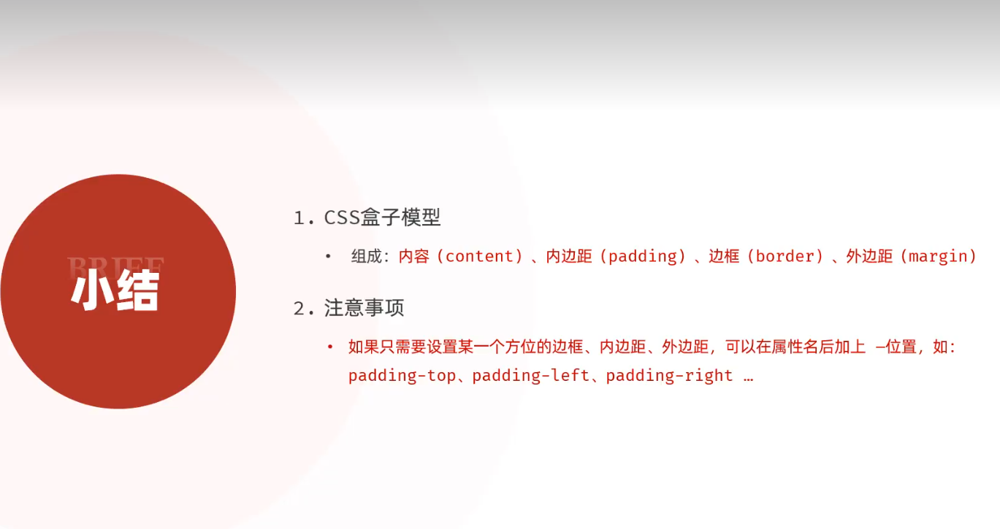

### 常见标签和样式-tlias案例-顶部导航栏

页面原型:是在应用程序开发初期，由产品经理制作的早期项目模型，主要用于展示页面的基本布局、功能以及交互设计，其作用是帮助设计师、开发者等更好地理解和讨论最终产品的外观和行为 。

现在我们需要认识到<strong>提示词</strong>的重要性质


#### Flex弹性布局


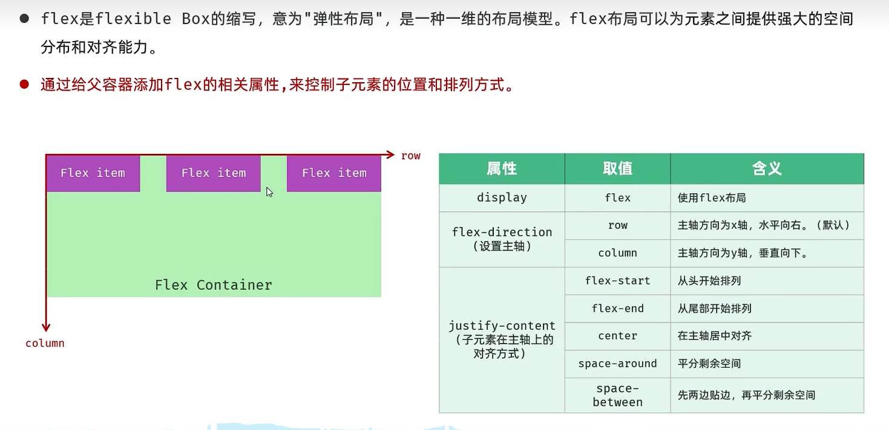

body标签自带的8px的外边距

```html
<!DOCTYPE html>
<html lang="en">

<head>
    <meta charset="UTF-8">
    <meta name="viewport" content="width=device-width, initial-scale=1.0">
    <title>Document</title>
    <style>
        /* body {
            margin: 0;
        } */

        #container {
            width: 500px;
            height: 300px;
            background-color: blue;
            display: flex;
            /* 弹性布局 */
            flex-direction: row;
            /* 垂直排列 */
            justify-content: space-between;
            /*解释justify-content每一个参数的含义*/
            /* flex-start: 从容器的起始位置开始排列 */
            /* flex-end: 从容器的结束位置开始排列 */
            /* center: 居中排列 */
            /* space-between: 均匀排列，第一个元素在容器的起始位置，最后一个元素在容器的结束位置 */
            /* space-around: 均匀排列，每个元素周围都有相同的空间 */
            /* space-evenly : 均匀排列，每个元素之间的空间相等 */

        }

        .box {
            width: 50px;
            height: 50px;
            background-color: red;
            border: 1px solid black;
        }
    </style>
</head>

<body>


    <div id="container">
        <div class="box">1</div>
        <div class="box">2</div>
        <div class="box">3</div>
    </div>
</body>
```
效果图
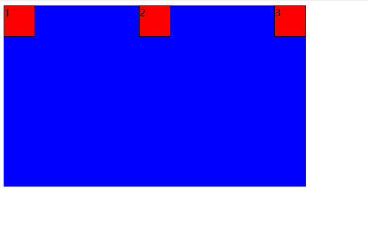

### HTML-CSS-常见标签和样式-表单标签


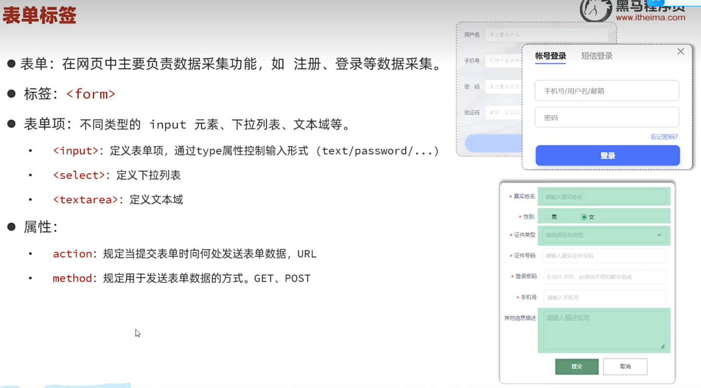


- get:将表单数据拼接在url后面,不安全,但是可以被缓存(默认)*,例如: /save?name=zhangsan&age=18 */
> 如果是隐私数据，就不推荐使用GET
在浏览器中GET请求大小有限制,不适合大数据的表单

- post:将表单数据放在请求体中,安全,但是不可以被缓存*/ 例如: /save -->
> 如果是隐私数据，就推荐使用POST
请求大小没有限制

效果图:
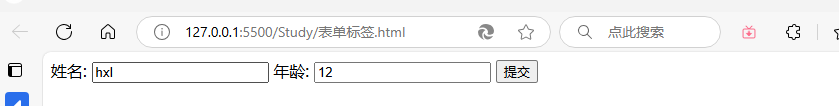
代码
```html
<!DOCTYPE html>
<html lang="en">

<head>
    <meta charset="UTF-8">
    <meta name="viewport" content="width=device-width, initial-scale=1.0">
    <title>Document</title>
</head>

<body>
    <!-- /*form表单元素*/
    /*form表单元素的作用：收集用户输入的数据*/
    /*form表单元素的属性：action,method,target*/
    /*action:表单提交的地址*/ -->
    <!-- /*method:表单提交的方式*/
    /*get:将表单数据拼接在url后面,不安全,但是可以被缓存(默认)*,例如: /save?name=zhangsan&age=18 */
    /*post:将表单数据放在请求体中,安全,但是不可以被缓存*/ 例如: /save -->
    <!-- 表单项要能够采集数据，就要设置name属性,表示当前表单项的名字 -->
    <form action="/save" method="post">
        姓名: <input type="text" name="name">
        年龄: <input type="number" name="age">
        <input type="submit" value="提交">
        
    </form>
</body>

</html>
```

### HTML-CSS-常见标签和样式-表单项标签


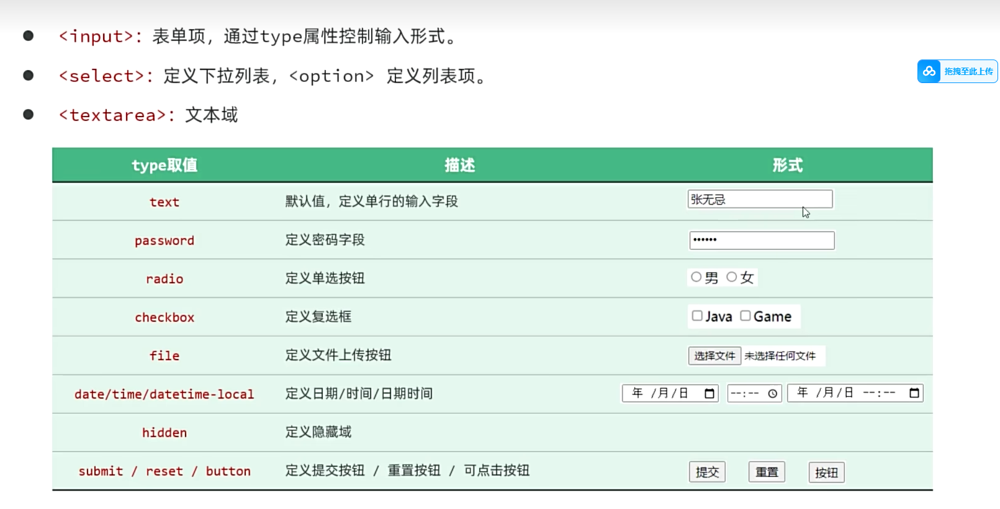

代码:POST请求

```html
<!DOCTYPE html>
<html lang="en">

<head>
    <meta charset="UTF-8">
    <meta name="viewport" content="width=device-width, initial-scale=1.0">
    <title>Document</title>
</head>

<body>
    <form action="/save" method="post">
        姓名: <input type="text" name="name"><br>

        年龄: <input type="number" name="age"><br>

        密码:
        <input type="password" name="password"><br>
        男<input type="radio" name="sex" value="male">
        女<input type="radio" name="sex" value="female"><br>


        选择学历:
        <select name="select">
            <option value="">-------------请选择-------------</option>
            <option value="大学">大学</option>
            <option value="中学">中学</option>
            <option value="初中">初中</option>
        </select><br>
        爱好:
        <input type="checkbox" name="hobby" value="Java">Java
        <input type="checkbox" name="hobby" value="Python">Python
        <input type="checkbox" name="hobby" value="跑步">跑步
        <br>
        个人简介:
        <textarea name="desc" id="1" cols="4" rows="4"></textarea><br>
        文件上传
        <input type="file" name="file"><br>
        时间:
        <input type="date" name="date"><br>

        <!-- 表单常见按钮 -->
        <input type="submit" value="提交">
        <input type="reset" value="重置">
        <input type="button" value="按钮">


    </form>
</body>

</html>
```


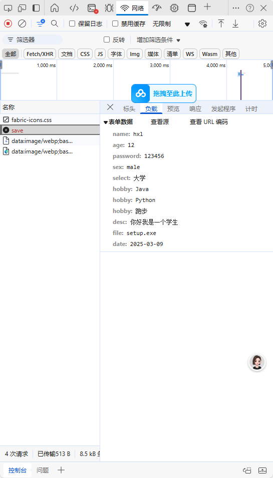


label标签
> 可以让被标签包裹的字被点击时也选中，而不是必须要点击圆圈

总结
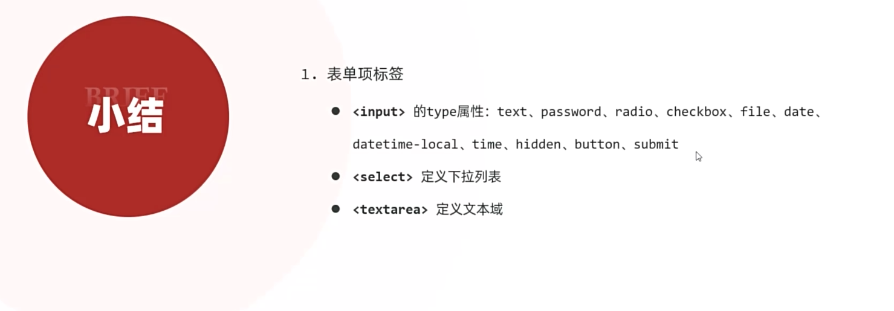


### HTML-CSS-常见标签和样式-tlias案例-搜索表单区域
skip


## JS-介绍
什么是 Javascript

Web 标准也称网页标准，由一系列的标准组成，大部分由 W3C (WorldWideWebConsortium, 万维网联盟) 负责制定。
三个组成部分:
- HTML: 负责网页的结构 (页面元素和内容)。
- CSS: 负责网页的表现 (页面元素的外观、位置等页面样式，如：颜色、大小等)。
- Javascript: 负责网页的行为 (交互效果)。


简介

>Javascript(简称:JS)是一门跨平台、面向对象的脚本语语言,是用来控制网页行为,实现页面的交互效果。
Javascript和Java是完全不同的语言,不论是概念还是概念还是设计。但是基础语法类似。

组成:
- ECMAScript:规定了JS基础语法核心知识,包括变量、数据类型、流程控制、函数、对象等。
- BOM:浏览器对象模型,用于操作浏览器本身,如:页面弹窗、地址栏操作、关闭窗口等。
- DOM:文档对象模型,用于操作HTML文档,如:改变标签内内的内容、改变标签内字体样式等。


### JS核心语法-引入方式

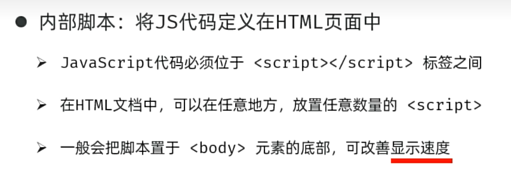

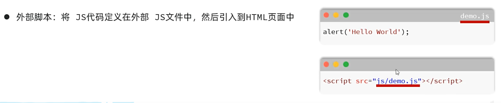


1. JS 引入方式
内部脚本：将 JS 代码定义在 HTML 页面的<script></script>中 (<:body> 的底部)
外部脚本：将 JS 代码定义在 JS 文件中，通过 < scriptsrc=""></script>标签引入
2. JS 书写规范
结束符：每行结尾以分号结尾，结尾分号可有可无

### JS 核心语法-变量&数据类型

> JS 中用 let 关键字来声明变量 (弱类型语言，变量可以存存放不同类型的值)。
变量名需要遵循如下规则:

- 只能用字母、数字、下划线 (_)、美元符号 ($) 组成，且数字不能开头

- 变量名严格区分大小写，如 name 和 Name 是不同的变量

- 不能使用关键字，如:let、var、if、for 等

JS 中用 const 关键字来声明常量。
一旦声明，常量的值就不能改变 (不可以重新赋值)

```javascript
    // 1. 变量的声明
    let a = 10;

    let b = "HelloWorld";
    //2.常量的声明
    const PI = 3.14;
    // PI = 12;
    alert(b)//弹出窗口
    console.log(PI)//输出到控制台
    document.write("你好")//直接写在body区域
```

JavaScript 的数据类型分为：基本数据类型和引用数据类型 (对象)。
基本数据类型:
- number: 数字 (整数、小数、NaN (Not a Number))
- boolean: 布尔。true,false
- null: 对象为空。Javascript 是大小写敏感的，因此 null、Null、Nu11、NULL 是完全不同的
- undefined: 当声明的变量未初始化时，该变量的默认值是 undefined
-  string: 字符串，单引号、双引号、反引号皆可，推荐使用单引号

使用typeof可以查看数据的类型
```js
typeof 变量
```


数据类型
模板字符串语法:
(反引号，英文输入模式下按键盘的 tab 键上方波浪线～那个个键
内容拼接变量时，使用 ${} 包住变量
```js
let str = 'Fuck';
console.log(`${str}you`)
```

 ### JS 核心语法-函数

 


实例代码
```js
<script>
    //1.函数的定义和调用
    function add(a, b) {//-具名函数
      return a + b;
    }
    let result = add(12, 10);
    alert(result)


    //2.1
    //函数表达式
    let func = function (a, b) {
      return a * b;
    }
    //2.2
    // 箭头函数
    let a = (a, b) => {
      return a + b;
    }
    alert(a(2, 3))
  </script>

```

 ### JS-核心语法-自定义对象&JSON

#### 自定义对象


调用方式:

- 调用属性
> 对象名.属性名;

- 调用方法
> 对象名.方法名

注意尽量不要用箭头函数
```js
let user = {
      name: 'hexiaolei',
      age: 18,
      address: '苏州',
      say: function (str) {
        alert(str);
      },
      //也可以
      sayA(str2) {
        alert(str2)
      },
      //在箭头函数中，this并不指向当前对象，指向的是当前元素的上级
      sayB: () => {
        alert(this + 'hello')
      }
    }
    user.say('Hello');
    user.sayA('helloAgain')
    user.sayB()

```
因为`sayB`方法中的this,指向的是object window,而不是当前对象

#### JSON

概念:JavaScript Object Notation,JavaScript对象标记法(JS对象标记法书写的文本)

由于语法简单，层次结构鲜明，所以常用于数据载体，在网络中进行传输


JSON格式:`{key:value,key1:value,key2:value}`

```js
//讲js对象转化为字符串,JSON.stringify()
    let user = {
      name: 'hexiaolei',
      age: '18',
      addresss: '苏州',
    }
    //js->json
    console.log(JSON.stringify(user))

    //json->js
    let jsonString = '{"name":"hexiaolei","age":18,"address":"Suzhou"}'
    alert(JSON.parse(jsonString).name)
```
