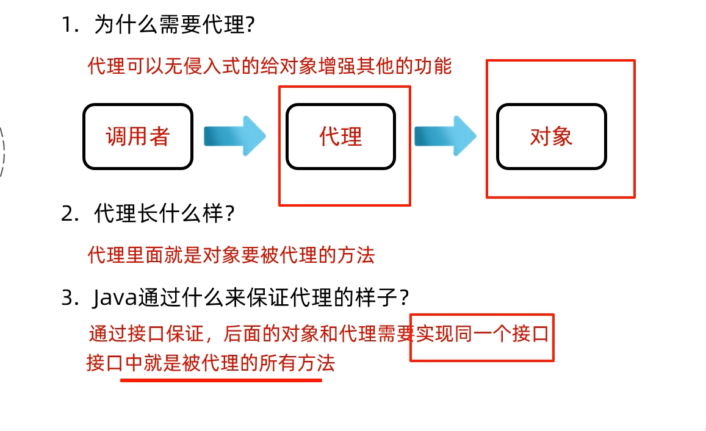

# 前端学习

## HTML-CSS

### Vscode开发工具

meta标签

> <meta> 是 HTML 中的一个元数据标签，用于提供关于 HTML 文档的元信息，这些信息不会直接显示在页面上，但对于浏览器和搜索引擎等工具来说非常重要。<meta> 标签通常位于 HTML 文档的 <head> 部分。

代码

```html
<!DOCTYPE html>
<html lang="en">
<head>
    <!-- 字符集 -->
    <meta charset="UTF-8">
    <!-- 在移动设备的显示和缩放比例 -->
    <meta name="viewport" content="width=device-width, initial-scale=1.0">
    <title>Document</title>
</head>
   <body>
        <h1>Html快速入门</h1>
        <!-- alt描述,width,height设置长宽 -->
        
        <h1>我是一级标题</h1>
   </body>
</html>
```

### 常见标签和样式-央视新闻-标题-排版

html在渲染时，从上往下逐行解析展示的

**只有h1-h6没有多余的**

### 常见标签和样式-央视新闻-标题-样式

#### CSS 引入方式

- **行内样式**：写在标签的`style`属性中（配合 JavaScript 使用）
- **内部样式**：写在`<style>`标签中（可以写在页面任何位置，但通常约定写在`<head>`标签中）
- **外部样式**：写在一个单独的`.css`文件中（需要通过`<link>`标签在网页中引入）


### 常见标签和样式-央视新闻-标题-样式(选择器)

> CSS选择器是用来选取需要设置样式的元素(标签)的

| 选择器     | 写法                | 示例       | 示例说明                               |
| ---------- | ------------------- | ---------- | -------------------------------------- |
| **元素选择器** | 元素名称 {...}      | h1 {...}   | 选择页面上所有的<h1>标签               |
| **类选择器** | .class 属性值 {...} | .cls {...} | 选择页面上所有 class 属性为 cls 的标签 |
| **id 选择器** | #id 属性值 {...}    | #hid {...} | 选择页面上 id 属性为 hid 的标签        |
|分组选择器|选择器1,选择器2 {...}|h1,h2 {...}|选择页面上所有的<h1>和<h2>标签|
|属性选择器|元素名称[属性] {...}|input[type] {...}|选择页面上有type属性的<input>标签|
|属性选择器|元素名称[属性名="值"] {...}|input[type="text"] {...}|选择页面上type属性为text的<input>标签|
|后代选择器|元素1 元素2 {...}|form input {...}|选择<form>标签内的所有<input>标签|

### 常见标签和样式-央视新闻-正文-排版

代码

```html
<!DOCTYPE html>
<html lang="en">
    <head>
        <meta charset="UTF-8">
        <meta name="viewport" content="width=device-width, initial-scale=1.0">
        <title>【新思想引领新征程】推进长江十年禁渔 谱写长江大保护新篇章</title>
        <style>
          #time{
            color: #b2b2b2;
          }    
          a{
            /* 去除超链接下的下划线 */
            text-decoration:none;
          }
        </style>
        <!-- 方式3：外部样式 -->
        <!-- <link rel="stylesheet" href="./css/news.css"> -->
    </head>
    <body>
        <!--  -------------------新闻标题-------------------- -->
        <h1>【新思想引领新征程】推进长江十年禁渔 谱写长江大保护新篇章</h1>
      
        <a href="https://www.cctv.com" target="_blank" >央视网</a> 
        <!-- 发布时间 -->
        <span id="time">2024年05月15日 20:07</span>
        <br>
        <!--  -------------------新闻主体-------------------- -->
        <!-- 引入一个视频,路径为./video/video.mp4,controls表示显示控件-->
         <!-- video标签属性
          src-视频路径
          controls-显示控件
          autoplay-自动播放
          width-宽度
          height-高度,建议只设置一个,另一个会自动适应
            px：像素
            百分比：相对于父元素的宽度
            自动：根据视频的宽度自动调整
          loop-循环播放
          poster-封面图片
          muted-静音
          preload-预加载
         -->
        <video src="./video/news.mp4" controls width="80%"></video>
        <!-- <audio src="./audio/news_1739964534813.mp3" controls></audio> -->
        <p>央视网消息（新闻联播）：作为共抓长江大保护的标志性工程，长江十年禁渔今年进入第四年。习近平总书记指出，长江禁渔是为全局计、为子孙谋的重要决策。牢记总书记嘱托，沿江省市持续推进长江水生生物多样性恢复，努力保障退捕渔民就业生活。这段时间，记者深入长江两岸，记录下禁渔工作取得的重要阶段性成效和广大干部群众坚定不移推进长江十年禁渔的扎实行动。</p>
        <p>行走在长江沿线，科研人员发现很多可喜现象。</p>
        <!-- 引入一张gif，在./Picture目录下 -->
        <!-- img标签属性
        src-访问路径
        1.绝对路径
          1.1绝对磁盘路径:C:\Users\Administrator\Desktop\Study\Picture\1_1739964534896.gif
          1.2绝对网络路径:https://www.baidu.com/img/bd_logo1.png
        2.相对路径
          2.1./表示当前目录(可以省略)
          2.2../表示上一级目录
         
        alt-图片描述
        width-宽度
        height-高度,建议只设置一个,另一个会自动适应
        px：像素
        百分比：相对于父元素的宽度
        自动：根据图片的宽度自动调整 -->
        </img>
        <p>在长江南源，一处小头裸裂尻鱼新的栖息地被发现，鱼的数量大约超3万尾，为水生态保护提供了珍贵数据。</p>
        <br>
        <p>在长江中游，追踪显示，人工增殖放流的中华鲟成功入海率已经从45%左右提升至60%以上；鄱阳湖鱼类小型化、低龄化趋势得到遏制，栖息地生存环境得以改善。</p>
        <br>
        <p>在长江下游，今年3月起，南京秦淮河入江口首次出现野生中华绒螯蟹大规模洄游现象，种群数量明显增加。</p>
        
        
        <p>水生生物资源恢复向好，见证了长江十年禁渔三年多来的阶段性成果。</p>
        <br>
        <p>实施长江十年禁渔，是以习近平同志为核心的党中央从中华民族长远利益出发作出的重要决策。党的十八大以来，总书记多次深入长江沿线考察调研，详细了解长江十年禁渔的实施情况，他指出，要坚定推进长江十年禁渔，巩固好已经取得的成果。</p>
        
        
        <p>按照部署，自2021年1月1日起，在长江干流、大型通江湖泊、重要支流和长江口部分海域实行为期十年的禁渔，常年禁止天然渔业资源的生产性捕捞。禁渔三年多来，相关评估显示，长江干流和鄱阳湖、洞庭湖水生生物完整性指数由禁渔前最差的“无鱼”提升了两个等级。2022年，长江江豚数量达到1249头，实现历史性止跌回升。长江干流水质连续4年全线保持Ⅱ类。</p>
        <br>
        <p>实施长江十年禁渔，解决好渔民上岸后的生产生活问题，禁渔才有稳定扎实的社会基础。</p>
        
        
        <p>安徽退捕转产的3万多名渔民，在政府的引导下接受就业培训。在当涂县，免费学习养殖技术，养殖生态螃蟹成了退捕渔民的新选择。</p>
        <br>
        <p>在拥有洞庭湖超六成水域的湖南岳阳，政府帮扶上岸渔民建起养殖场，发展风干鱼产业，还带领他们学习直播带货，拓宽销路。</p>
        <br>
        <p>在渔民退捕上岸的鄱阳湖棠荫岛，当地在继续保护好生态的前提下，正探索规划利用独特的自然资源发展旅游产业。禁渔三年多来，有关部门对23.1万退捕渔民逐一建档立卡，多渠道提升就业、社保水平。</p>

        
        <p>长江十年禁渔实施以来，沿江省市合力攻坚、久久为功，长江大保护不断向纵深推进，持续巩固禁渔成果。下一步，沿江省市还将加强水生生物重要栖息地修复，建立退捕渔民动态精准帮扶服务，完善跨区域、跨部门执法合作机制，确保一江清水绵延后世、惠泽人民。</p>
    </body>
</html>
```

### 常见标签和样式-央视新闻-正文-样式

代码

```html
<!DOCTYPE html>
<html lang="en">
    <head>
        <meta charset="UTF-8">
        <meta name="viewport" content="width=device-width, initial-scale=1.0">
        <title>【新思想引领新征程】推进长江十年禁渔 谱写长江大保护新篇章</title>
        <style>
          #time{
            color: #b2b2b2;
          }    
          a{
            /* 去除超链接下的下划线 */
            text-decoration:none;
          }
          p{
            /* 首行缩进 */
            text-indent: 2em;
            /* 行高 */
            line-height: 2;/* 行高为字体大小的2倍 */
          }
        </style>
        <!-- 方式3：外部样式 -->
        <!-- <link rel="stylesheet" href="./css/news.css"> -->
    </head>
    <body>
        <!--  -------------------新闻标题-------------------- -->
        <h1>【新思想引领新征程】推进长江十年禁渔 谱写长江大保护新篇章</h1>
      
        <a href="https://www.cctv.com" target="_blank" >央视网</a> 
        <!-- 发布时间 -->
        <span id="time">2024年05月15日 20:07</span>
        <br>
        <!--  -------------------新闻主体-------------------- -->
        <!-- 引入一个视频,路径为./video/video.mp4,controls表示显示控件-->
         <!-- video标签属性
          src-视频路径
          controls-显示控件
          autoplay-自动播放
          width-宽度
          height-高度,建议只设置一个,另一个会自动适应
            px：像素
            百分比：相对于父元素的宽度
            自动：根据视频的宽度自动调整
          loop-循环播放
          poster-封面图片
          muted-静音
          preload-预加载
         -->
        <video src="./video/news.mp4" controls width="80%"></video>
        <!-- <audio src="./audio/news_1739964534813.mp3" controls></audio> -->
        <p><!-- &nbsp;表示一个空格字符 -->
          <b>央视网消息</b>
          （新闻联播）：作为共抓长江大保护的标志性工程，长江十年禁渔今年进入第四年。习近平总书记指出，长江禁渔是为全局计、为子孙谋的重要决策。牢记总书记嘱托，沿江省市持续推进长江水生生物多样性恢复，努力保障退捕渔民就业生活。这段时间，记者深入长江两岸，记录下禁渔工作取得的重要阶段性成效和广大干部群众坚定不移推进长江十年禁渔的扎实行动。
        </p>
        <p>行走在长江沿线，科研人员发现很多可喜现象。</p>
        <!-- 引入一张gif，在./Picture目录下 -->
        <!-- img标签属性
        src-访问路径
        1.绝对路径
          1.1绝对磁盘路径:C:\Users\Administrator\Desktop\Study\Picture\1_1739964534896.gif
          1.2绝对网络路径:https://www.baidu.com/img/bd_logo1.png
        2.相对路径
          2.1./表示当前目录(可以省略)
          2.2../表示上一级目录
         
        alt-图片描述
        width-宽度
        height-高度,建议只设置一个,另一个会自动适应
        px：像素
        百分比：相对于父元素的宽度
        自动：根据图片的宽度自动调整 -->
        </img>
        <p>在长江南源，一处小头裸裂尻鱼新的栖息地被发现，鱼的数量大约超3万尾，为水生态保护提供了珍贵数据。</p>
        <br>
        <p>在长江中游，追踪显示，人工增殖放流的中华鲟成功入海率已经从45%左右提升至60%以上；鄱阳湖鱼类小型化、低龄化趋势得到遏制，栖息地生存环境得以改善。</p>
        <br>
        <p>在长江下游，今年3月起，南京秦淮河入江口首次出现野生中华绒螯蟹大规模洄游现象，种群数量明显增加。</p>
        
        
        <p>水生生物资源恢复向好，见证了长江十年禁渔三年多来的阶段性成果。</p>
        <br>
        <p>实施长江十年禁渔，是以习近平同志为核心的党中央从中华民族长远利益出发作出的重要决策。党的十八大以来，总书记多次深入长江沿线考察调研，详细了解长江十年禁渔的实施情况，他指出，要坚定推进长江十年禁渔，巩固好已经取得的成果。</p>
        
        
        <p>按照部署，自2021年1月1日起，在长江干流、大型通江湖泊、重要支流和长江口部分海域实行为期十年的禁渔，常年禁止天然渔业资源的生产性捕捞。禁渔三年多来，相关评估显示，长江干流和鄱阳湖、洞庭湖水生生物完整性指数由禁渔前最差的“无鱼”提升了两个等级。2022年，长江江豚数量达到1249头，实现历史性止跌回升。长江干流水质连续4年全线保持Ⅱ类。</p>
        <br>
        <p>实施长江十年禁渔，解决好渔民上岸后的生产生活问题，禁渔才有稳定扎实的社会基础。</p>
        
        
        <p>安徽退捕转产的3万多名渔民，在政府的引导下接受就业培训。在当涂县，免费学习养殖技术，养殖生态螃蟹成了退捕渔民的新选择。</p>
        <br>
        <p>在拥有洞庭湖超六成水域的湖南岳阳，政府帮扶上岸渔民建起养殖场，发展风干鱼产业，还带领他们学习直播带货，拓宽销路。</p>
        <br>
        <p>在渔民退捕上岸的鄱阳湖棠荫岛，当地在继续保护好生态的前提下，正探索规划利用独特的自然资源发展旅游产业。禁渔三年多来，有关部门对23.1万退捕渔民逐一建档立卡，多渠道提升就业、社保水平。</p>

        
        <p>长江十年禁渔实施以来，沿江省市合力攻坚、久久为功，长江大保护不断向纵深推进，持续巩固禁渔成果。下一步，沿江省市还将加强水生生物重要栖息地修复，建立退捕渔民动态精准帮扶服务，完善跨区域、跨部门执法合作机制，确保一江清水绵延后世、惠泽人民。</p>
    </body>
</html> 
```


### 常见标签和样式-央视新闻-整体样式

代码

```html
<!DOCTYPE html>
<html lang="en">
    <head>
        <meta charset="UTF-8">
        <meta name="viewport" content="width=device-width, initial-scale=1.0">
        <title>【新思想引领新征程】推进长江十年禁渔 谱写长江大保护新篇章</title>
        <style>
          #time{
            color: #b2b2b2;
          }    
          a{
            /* 去除超链接下的下划线 */
            text-decoration:none;
          }
          p{
            /* 首行缩进 */
            text-indent: 2em;
            /* 行高 */
            line-height: 2;/* 行高为字体大小的2倍 */
          }
          #page{
            width: 70%;/* 上下外边距为0，左右外边距自动，实现居中显示 */
            margin-left: auto;
            margin-right: auto;
          }
        </style>
        <!-- 方式3：外部样式 -->
        <!-- <link rel="stylesheet" href="./css/news.css"> -->
    </head>
    <body>
      <div id="page">
       
        <!--  -------------------新闻标题-------------------- -->
        <h1>【新思想引领新征程】推进长江十年禁渔 谱写长江大保护新篇章</h1>
      
        <a href="https://www.cctv.com" target="_blank" >央视网</a> 
        <!-- 发布时间 -->
        <span id="time">2024年05月15日 20:07</span>
        <br>
        <!--  -------------------新闻主体-------------------- -->
        <!-- 引入一个视频,路径为./video/video.mp4,controls表示显示控件-->
         <!-- video标签属性
          src-视频路径
          controls-显示控件
          autoplay-自动播放
          width-宽度
          height-高度,建议只设置一个,另一个会自动适应
            px：像素
            百分比：相对于父元素的宽度
            自动：根据视频的宽度自动调整
          loop-循环播放
          poster-封面图片
          muted-静音
          preload-预加载
         -->
        <video src="./video/news.mp4" controls width="100%"></video>
        <!-- <audio src="./audio/news_1739964534813.mp3" controls></audio> -->
        <p><!-- &nbsp;表示一个空格字符 -->
          <b>央视网消息</b>
          （新闻联播）：作为共抓长江大保护的标志性工程，长江十年禁渔今年进入第四年。习近平总书记指出，长江禁渔是为全局计、为子孙谋的重要决策。牢记总书记嘱托，沿江省市持续推进长江水生生物多样性恢复，努力保障退捕渔民就业生活。这段时间，记者深入长江两岸，记录下禁渔工作取得的重要阶段性成效和广大干部群众坚定不移推进长江十年禁渔的扎实行动。
        </p>
        <p>行走在长江沿线，科研人员发现很多可喜现象。</p>
        <!-- 引入一张gif，在./Picture目录下 -->
        <!-- img标签属性
        src-访问路径
        1.绝对路径
          1.1绝对磁盘路径:C:\Users\Administrator\Desktop\Study\Picture\1_1739964534896.gif
          1.2绝对网络路径:https://www.baidu.com/img/bd_logo1.png
        2.相对路径
          2.1./表示当前目录(可以省略)
          2.2../表示上一级目录
         
        alt-图片描述
        width-宽度
        height-高度,建议只设置一个,另一个会自动适应
        px：像素
        百分比：相对于父元素的宽度
        自动：根据图片的宽度自动调整 -->
        </img>
        <p>在长江南源，一处小头裸裂尻鱼新的栖息地被发现，鱼的数量大约超3万尾，为水生态保护提供了珍贵数据。</p>
        <br>
        <p>在长江中游，追踪显示，人工增殖放流的中华鲟成功入海率已经从45%左右提升至60%以上；鄱阳湖鱼类小型化、低龄化趋势得到遏制，栖息地生存环境得以改善。</p>
        <br>
        <p>在长江下游，今年3月起，南京秦淮河入江口首次出现野生中华绒螯蟹大规模洄游现象，种群数量明显增加。</p>
        
        
        <p>水生生物资源恢复向好，见证了长江十年禁渔三年多来的阶段性成果。</p>
        <br>
        <p>实施长江十年禁渔，是以习近平同志为核心的党中央从中华民族长远利益出发作出的重要决策。党的十八大以来，总书记多次深入长江沿线考察调研，详细了解长江十年禁渔的实施情况，他指出，要坚定推进长江十年禁渔，巩固好已经取得的成果。</p>
        
        
        <p>按照部署，自2021年1月1日起，在长江干流、大型通江湖泊、重要支流和长江口部分海域实行为期十年的禁渔，常年禁止天然渔业资源的生产性捕捞。禁渔三年多来，相关评估显示，长江干流和鄱阳湖、洞庭湖水生生物完整性指数由禁渔前最差的“无鱼”提升了两个等级。2022年，长江江豚数量达到1249头，实现历史性止跌回升。长江干流水质连续4年全线保持Ⅱ类。</p>
        <br>
        <p>实施长江十年禁渔，解决好渔民上岸后的生产生活问题，禁渔才有稳定扎实的社会基础。</p>
        
        
        <p>安徽退捕转产的3万多名渔民，在政府的引导下接受就业培训。在当涂县，免费学习养殖技术，养殖生态螃蟹成了退捕渔民的新选择。</p>
        <br>
        <p>在拥有洞庭湖超六成水域的湖南岳阳，政府帮扶上岸渔民建起养殖场，发展风干鱼产业，还带领他们学习直播带货，拓宽销路。</p>
        <br>
        <p>在渔民退捕上岸的鄱阳湖棠荫岛，当地在继续保护好生态的前提下，正探索规划利用独特的自然资源发展旅游产业。禁渔三年多来，有关部门对23.1万退捕渔民逐一建档立卡，多渠道提升就业、社保水平。</p>

        
        <p>长江十年禁渔实施以来，沿江省市合力攻坚、久久为功，长江大保护不断向纵深推进，持续巩固禁渔成果。下一步，沿江省市还将加强水生生物重要栖息地修复，建立退捕渔民动态精准帮扶服务，完善跨区域、跨部门执法合作机制，确保一江清水绵延后世、惠泽人民。</p>
        </div>
      </body>
</html>
```

#### 盒子模型


代码

```html
<!DOCTYPE html>
<html lang="en">
<head>
  <meta charset="UTF-8">
  <meta name="viewport" content="width=device-width, initial-scale=1.0">
  <title>Document</title>
  <style>
    #div1{
      width: 400px;/*默认是内容展示区域的宽度*/
      height: 400px;
      background-color: pink;
      padding: 30px;
      box-sizing: border-box;/*属性值改为这个就会让盒子外面变成400,300而不是内容显示区域*/
      /* 设置边框 */
      border: 10px solid red;
      /* 设置外边距 */
      margin: 30px auto; /*上下外边距为30,左右外边距自动,实现居中显示*/
    }
  </style>
</head>
<body>
    <div id="div1">
        A A A A A A A A A A A A A A A A
    </div>
</body>
</html>
```

效果:


总结


### 常见标签和样式-tlias案例-顶部导航栏

页面原型:是在应用程序开发初期，由产品经理制作的早期项目模型，主要用于展示页面的基本布局、功能以及交互设计，其作用是帮助设计师、开发者等更好地理解和讨论最终产品的外观和行为 。

现在我们需要认识到<strong>提示词</strong>的重要性质


#### Flex弹性布局


body标签自带的8px的外边距

```html
<!DOCTYPE html>
<html lang="en">

<head>
    <meta charset="UTF-8">
    <meta name="viewport" content="width=device-width, initial-scale=1.0">
    <title>Document</title>
    <style>
        /* body {
            margin: 0;
        } */

        #container {
            width: 500px;
            height: 300px;
            background-color: blue;
            display: flex;
            /* 弹性布局 */
            flex-direction: row;
            /* 垂直排列 */
            justify-content: space-between;
            /*解释justify-content每一个参数的含义*/
            /* flex-start: 从容器的起始位置开始排列 */
            /* flex-end: 从容器的结束位置开始排列 */
            /* center: 居中排列 */
            /* space-between: 均匀排列，第一个元素在容器的起始位置，最后一个元素在容器的结束位置 */
            /* space-around: 均匀排列，每个元素周围都有相同的空间 */
            /* space-evenly : 均匀排列，每个元素之间的空间相等 */

        }

        .box {
            width: 50px;
            height: 50px;
            background-color: red;
            border: 1px solid black;
        }
    </style>
</head>

<body>


    <div id="container">
        <div class="box">1</div>
        <div class="box">2</div>
        <div class="box">3</div>
    </div>
</body>
```
效果图


### HTML-CSS-常见标签和样式-表单标签


- get:将表单数据拼接在url后面,不安全,但是可以被缓存(默认)*,例如: /save?name=zhangsan&age=18 */
> 如果是隐私数据，就不推荐使用GET
在浏览器中GET请求大小有限制,不适合大数据的表单

- post:将表单数据放在请求体中,安全,但是不可以被缓存*/ 例如: /save -->
> 如果是隐私数据，就推荐使用POST
请求大小没有限制

效果图:

代码
```html
<!DOCTYPE html>
<html lang="en">

<head>
    <meta charset="UTF-8">
    <meta name="viewport" content="width=device-width, initial-scale=1.0">
    <title>Document</title>
</head>

<body>
    <!-- /*form表单元素*/
    /*form表单元素的作用：收集用户输入的数据*/
    /*form表单元素的属性：action,method,target*/
    /*action:表单提交的地址*/ -->
    <!-- /*method:表单提交的方式*/
    /*get:将表单数据拼接在url后面,不安全,但是可以被缓存(默认)*,例如: /save?name=zhangsan&age=18 */
    /*post:将表单数据放在请求体中,安全,但是不可以被缓存*/ 例如: /save -->
    <!-- 表单项要能够采集数据，就要设置name属性,表示当前表单项的名字 -->
    <form action="/save" method="post">
        姓名: <input type="text" name="name">
        年龄: <input type="number" name="age">
        <input type="submit" value="提交">
        
    </form>
</body>

</html>
```

### HTML-CSS-常见标签和样式-表单项标签


代码:POST请求

```html
<!DOCTYPE html>
<html lang="en">

<head>
    <meta charset="UTF-8">
    <meta name="viewport" content="width=device-width, initial-scale=1.0">
    <title>Document</title>
</head>

<body>
    <form action="/save" method="post">
        姓名: <input type="text" name="name"><br>

        年龄: <input type="number" name="age"><br>

        密码:
        <input type="password" name="password"><br>
        男<input type="radio" name="sex" value="male">
        女<input type="radio" name="sex" value="female"><br>


        选择学历:
        <select name="select">
            <option value="">-------------请选择-------------</option>
            <option value="大学">大学</option>
            <option value="中学">中学</option>
            <option value="初中">初中</option>
        </select><br>
        爱好:
        <input type="checkbox" name="hobby" value="Java">Java
        <input type="checkbox" name="hobby" value="Python">Python
        <input type="checkbox" name="hobby" value="跑步">跑步
        <br>
        个人简介:
        <textarea name="desc" id="1" cols="4" rows="4"></textarea><br>
        文件上传
        <input type="file" name="file"><br>
        时间:
        <input type="date" name="date"><br>

        <!-- 表单常见按钮 -->
        <input type="submit" value="提交">
        <input type="reset" value="重置">
        <input type="button" value="按钮">


    </form>
</body>

</html>
```


label标签
> 可以让被标签包裹的字被点击时也选中，而不是必须要点击圆圈

总结


### HTML-CSS-常见标签和样式-tlias案例-搜索表单区域
skip


## JS-介绍
什么是 Javascript

Web 标准也称网页标准，由一系列的标准组成，大部分由 W3C (WorldWideWebConsortium, 万维网联盟) 负责制定。
三个组成部分:
- HTML: 负责网页的结构 (页面元素和内容)。
- CSS: 负责网页的表现 (页面元素的外观、位置等页面样式，如：颜色、大小等)。
- Javascript: 负责网页的行为 (交互效果)。


简介

>Javascript(简称:JS)是一门跨平台、面向对象的脚本语语言,是用来控制网页行为,实现页面的交互效果。
Javascript和Java是完全不同的语言,不论是概念还是概念还是设计。但是基础语法类似。

组成:
- ECMAScript:规定了JS基础语法核心知识,包括变量、数据类型、流程控制、函数、对象等。
- BOM:浏览器对象模型,用于操作浏览器本身,如:页面弹窗、地址栏操作、关闭窗口等。
- DOM:文档对象模型,用于操作HTML文档,如:改变标签内内的内容、改变标签内字体样式等。


### JS核心语法-引入方式


1. JS 引入方式
内部脚本：将 JS 代码定义在 HTML 页面的<script></script>中 (<:body> 的底部)
外部脚本：将 JS 代码定义在 JS 文件中，通过 < scriptsrc=""></script>标签引入
2. JS 书写规范
结束符：每行结尾以分号结尾，结尾分号可有可无

### JS 核心语法-变量&数据类型

> JS 中用 let 关键字来声明变量 (弱类型语言，变量可以存存放不同类型的值)。
变量名需要遵循如下规则:

- 只能用字母、数字、下划线 (_)、美元符号 ($) 组成，且数字不能开头

- 变量名严格区分大小写，如 name 和 Name 是不同的变量

- 不能使用关键字，如:let、var、if、for 等

JS 中用 const 关键字来声明常量。
一旦声明，常量的值就不能改变 (不可以重新赋值)

```javascript
    // 1. 变量的声明
    let a = 10;

    let b = "HelloWorld";
    //2.常量的声明
    const PI = 3.14;
    // PI = 12;
    alert(b)//弹出窗口
    console.log(PI)//输出到控制台
    document.write("你好")//直接写在body区域
```

JavaScript 的数据类型分为：基本数据类型和引用数据类型 (对象)。
基本数据类型:
- number: 数字 (整数、小数、NaN (Not a Number))
- boolean: 布尔。true,false
- null: 对象为空。Javascript 是大小写敏感的，因此 null、Null、Nu11、NULL 是完全不同的
- undefined: 当声明的变量未初始化时，该变量的默认值是 undefined
-  string: 字符串，单引号、双引号、反引号皆可，推荐使用单引号

使用typeof可以查看数据的类型
```js
typeof 变量
```


数据类型
模板字符串语法:
(反引号，英文输入模式下按键盘的 tab 键上方波浪线～那个个键
内容拼接变量时，使用 ${} 包住变量
```js
let str = 'Fuck';
console.log(`${str}you`)
```

 ### JS 核心语法-函数

 


实例代码
```html
<script>
    //1.函数的定义和调用
    function add(a, b) {//-具名函数
      return a + b;
    }
    let result = add(12, 10);
    alert(result)


    //2.1
    //函数表达式
    let func = function (a, b) {
      return a * b;
    }
    //2.2
    // 箭头函数
    let a = (a, b) => {
      return a + b;
    }
    alert(a(2, 3))
  </script>

```

 ### JS-核心语法-自定义对象&JSON

#### 自定义对象


调用方式:

- 调用属性
> 对象名.属性名;

- 调用方法
> 对象名.方法名

注意尽量不要用箭头函数
```js
let user = {
      name: 'hexiaolei',
      age: 18,
      address: '苏州',
      say: function (str) {
        alert(str);
      },
      //也可以
      sayA(str2) {
        alert(str2)
      },
      //在箭头函数中，this并不指向当前对象，指向的是当前元素的上级
      sayB: () => {
        alert(this + 'hello')
      }
    }
    user.say('Hello');
    user.sayA('helloAgain')
    user.sayB()

```
因为`sayB`方法中的this,指向的是object window,而不是当前对象

#### JSON

概念:JavaScript Object Notation,JavaScript对象标记法(JS对象标记法书写的文本)

由于语法简单，层次结构鲜明，所以常用于数据载体，在网络中进行传输


JSON格式:`{key:value,key1:value,key2:value}`
z
```js
//讲js对象转化为字符串,JSON.stringify()
    let user = {
      name: 'hexiaolei',
      age: '18',
      addresss: '苏州',
    }
    //js->json
    console.log(JSON.stringify(user))

    //json->js
    let jsonString = '{"name":"hexiaolei","age":18,"address":"Suzhou"}'
    alert(JSON.parse(jsonString).name)
```


### JS-核心语法-DOM

概念:Document Object Model,文档对象模型

将标记语言的各个组成部分分装为对应的对象:
- Document:整个文档对象
- Element:元素对象
- Attribute:属性对象
- Text:文本对象
- Cpmment:注释对象


JavaScritp通过DOM，可以对html进行以下更改
- 改变html元素内容
- 改变html元素样式(css)
- 对html DOM时间做出反应
- 添加或者删除html元素

DOM操作核心思想: 将网页中所有元素当作对象处理，（标签的所有属性在该对象上都可以找到）

操作步骤:
- 获取要操作的DOM对象
- 操作DOM对象的属性和方法

获取DOM对象
- 根据CSS选择器来选择DOM元素，获取匹配到的第一个元素:document.querySelector('选择器')
- 根据CSS选择器来选择DOM元素，获取匹配到的第一个元素:document.querySelectorAll('选择器')//标签选择器span,类选择器.xxx,id选择器#xxx
！！！：得到的是NodeList节点集合，是一个伪数组(有长度，有索引的数组)


练习小代码
```html
<!DOCTYPE html>
<html lang="en">

<head>
  <meta charset="UTF-8">
  <meta name="viewport" content="width=device-width, initial-scale=1.0">
  <title>JS-DOM</title>
</head>

<body>

  <h1 id="title1">11111</h1>
  <h1>22222</h1>
  <h1>33333</h1>

  <script>
    //修改第一个h1标签的内容

    let h = document.querySelector('h1');
    h.innerHTML = '48123428-1039';
    // document.querySelectorAll('h1')[1].innerHTML = '555555';

    let all = document.querySelectorAll('h1');

    for (let i = 0; i < all.length; i++) {
      all[i].innerHTML = '666666';
    }

  </script>
</body>

</html>


```

### JS-核心语法-事件监听

事件:HTML事件是发生在HTML元素上的事情,例如
- 按钮被点击
- 鼠标移动要元素上
- 按下键盘按键

事件监听:JavaScript可以在事件触发时，就立刻调用一个函数，也称为事件绑定或注册事件.

语法:`事件源.addEventListener('事件类型',事件触发执行的函数)`
事件监听三要素:
- 事件源：哪个dom元素出发了事件，要获取dom元素
- 事件类型:用什么方式出发，比如：鼠标单击click
- 事件触发执行的函数:要做什么事情 


练习代码
```html

<!DOCTYPE html>
<html lang="zh-CN">

<head>
    <meta charset="UTF-8">
    <title>Tlias智能学习辅助系统</title>
    <style>
        /* 导航栏样式 */
        .navbar {
            background-color: #b5b3b3;
            /* 灰色背景 */

            display: flex;
            /* flex弹性布局 */
            justify-content: space-between;
            /* 左右对齐 */

            padding: 10px;
            /* 内边距 */
            align-items: center;
            /* 垂直居中 */
        }

        .navbar h1 {
            margin: 0;
            /* 移除默认的上下外边距 */
            font-weight: bold;
            /* 加粗 */
            color: white;
            /* 设置字体为楷体 */
            font-family: "楷体";
        }

        .navbar a {
            color: white;
            /* 链接颜色为白色 */
            text-decoration: none;
            /* 移除下划线 */
        }

        /* 搜索表单样式 */
        .search-form {
            display: flex;
            flex-wrap: nowrap;
            align-items: center;
            gap: 10px;
            /* 控件之间的间距 */
            margin: 20px 0;
        }

        .search-form input[type="text"],
        .search-form select {
            padding: 5px;
            /* 输入框内边距 */
            width: 260px;
            /* 宽度 */
        }

        .search-form button {
            padding: 5px 15px;
            /* 按钮内边距 */
        }

        /* 表格样式 */
        table {
            width: 100%;
            border-collapse: collapse;
        }

        th,
        td {
            border: 1px solid #ddd;
            /* 边框 */
            padding: 8px;
            /* 单元格内边距 */
            text-align: center;
            /* 左对齐 */
        }

        th {
            background-color: #f2f2f2;
            font-weight: bold;
        }

        .avatar {
            width: 30px;
            height: 30px;
        }

        /* 页脚样式 */
        .footer {
            background-color: #b5b3b3;
            /* 灰色背景 */
            color: white;
            /* 白色文字 */
            text-align: center;
            /* 居中文本 */
            padding: 10px 0;
            /* 上下内边距 */
            margin-top: 30px;
        }

        #container {
            width: 80%;
            /* 宽度为80% */
            margin: 0 auto;
            /* 水平居中 */
        }
    </style>
</head>

<body>
    <div id="container">
        <!-- 顶部导航栏 -->
        <div class="navbar">
            <h1>Tlias智能学习辅助系统</h1>
            <a href="#">退出登录</a>
        </div>

        <!-- 搜索表单区域 -->
        <form class="search-form" action="/search" method="post">
            <label for="name">姓名：</label>
            <input type="text" id="name" name="name" placeholder="请输入姓名">

            <label for="gender">性别：</label>
            <select id="gender" name="gender">
                <option value=""></option>
                <option value="1">男</option>
                <option value="2">女</option>
            </select>

            <label for="position">职位：</label>
            <select id="position" name="position">
                <option value=""></option>
                <option value="1">班主任</option>
                <option value="2">讲师</option>
                <option value="3">学工主管</option>
                <option value="4">教研主管</option>
                <option value="5">咨询师</option>
            </select>

            <button type="submit">查询</button>
            <button type="reset">清空</button>
        </form>

        <!-- 表格展示区 -->
        <table>
            <!-- 表头 -->
            <thead>
                <tr>
                    <th>姓名</th>
                    <th>性别</th>
                    <th>头像</th>
                    <th>职位</th>
                    <th>入职日期</th>
                    <th>最后操作时间</th>
                    <th>操作</th>
                </tr>
            </thead>

            <!-- 表格主体内容 -->
            <tbody>
                <tr>
                    <td>令狐冲</td>
                    <td>男</td>
                    <td></td>
                    <td>讲师</td>
                    <td>2021-06-15</td>
                    <td>2024-09-16 15:30</td>
                    <td class="action-buttons">
                        <button type="button">编辑</button>
                        <button type="button">删除</button>
                    </td>
                </tr>
                <tr>
                    <td>任盈盈</td>
                    <td>女</td>
                    <td></td>
                    <td>咨询师</td>
                    <td>2021-07-20</td>
                    <td>2024-09-17 09:00</td>
                    <td class="action-buttons">
                        <button type="button">编辑</button>
                        <button type="button">删除</button>
                    </td>
                </tr>
                <tr>
                    <td>向问天</td>
                    <td>男</td>
                    <td></td>
                    <td>班主任</td>
                    <td>2021-05-01</td>
                    <td>2024-09-15 17:45</td>
                    <td class="action-buttons">
                        <button type="button">编辑</button>
                        <button type="button">删除</button>
                    </td>
                </tr>
                <tr>
                    <td>任我行</td>
                    <td>男</td>
                    <td></td>
                    <td>教研主管</td>
                    <td>2021-05-01</td>
                    <td>2024-09-15 17:45</td>
                    <td class="action-buttons">
                        <button type="button">编辑</button>
                        <button type="button">删除</button>
                    </td>
                </tr>
                <tr>
                    <td>田伯光</td>
                    <td>男</td>
                    <td></td>
                    <td>班主任</td>
                    <td>2021-06-15</td>
                    <td>2024-09-16 15:30</td>
                    <td class="action-buttons">
                        <button type="button">编辑</button>
                        <button type="button">删除</button>
                    </td>
                </tr>
                <tr>
                    <td>不戒</td>
                    <td>女</td>
                    <td></td>
                    <td>班主任</td>
                    <td>2021-07-20</td>
                    <td>2024-09-17 09:00</td>
                    <td class="action-buttons">
                        <button type="button">编辑</button>
                        <button type="button">删除</button>
                    </td>
                </tr>
                <tr>
                    <td>左冷禅</td>
                    <td>男</td>
                    <td></td>
                    <td>班主任</td>
                    <td>2021-05-01</td>
                    <td>2024-09-15 17:45</td>
                    <td class="action-buttons">
                        <button type="button">编辑</button>
                        <button type="button">删除</button>
                    </td>
                </tr>
                <tr>
                    <td>定逸</td>
                    <td>女</td>
                    <td></td>
                    <td>班主任</td>
                    <td>2021-05-01</td>
                    <td>2024-09-15 17:45</td>
                    <td class="action-buttons">
                        <button type="button">编辑</button>
                        <button type="button">删除</button>
                    </td>
                </tr>
                <tr>
                    <td>东方兄弟</td>
                    <td>男</td>
                    <td></td>
                    <td>讲师</td>
                    <td>2021-05-01</td>
                    <td>2024-09-15 17:45</td>
                    <td class="action-buttons">
                        <button type="button">编辑</button>
                        <button type="button">删除</button>
                    </td>
                </tr>
                <tr>
                    <td>金庸</td>
                    <td>男</td>
                    <td></td>
                    <td>咨询师</td>
                    <td>2021-05-01</td>
                    <td>2024-09-15 17:45</td>
                    <td class="action-buttons">
                        <button type="button">编辑</button>
                        <button type="button">删除</button>
                    </td>
                </tr>
            </tbody>
        </table>

        <!-- 页脚版权区域 -->
        <footer class="footer">
            <p>江苏传智播客教育科技股份有限公司</p>
            <p>版权所有 Copyright 2006-2024 All Rights Reserved</p>
        </footer>
    </div>

    <script>
        //通过JS为上述的表格中数据行添加事件监听, 实现鼠标进入后, 背景色#f2e2e2; 鼠标离开后, 背景色需要设置为#fff; (JS新版本的语法)
        //两个标签选择器之间用逗号隔开,然后再用forEach方法遍历
        //forEach方法的参数是一个函数,这个函数有一个参数,这个参数就是当前遍历到的元素
        document.querySelectorAll('tbody tr').forEach((tr) => {
            tr.addEventListener('mouseenter', () => {
                tr.style.backgroundColor = '#f2e2e2';
            });
            tr.addEventListener('mouseleave', () => {
                tr.style.backgroundColor = '#fff';
            });
        });
    </script>
</body>

</html>

```


常见事件

|鼠标事件|键盘事件|焦点事件|表单事件|
|:-:|:-:|:-:|:-:|
|click(鼠标点击)|keydown(按下触发)|focus(获取焦点触发)|input(输入时触发)|
|mouseenter(鼠标移入)|keyup(抬起触发)|blur(失去焦点)|submit(提交时触发)|
|mouseleave(鼠标移出)|


### JS-核心语法-事件监听（优化）

JS模块化(export,import)

## Vue快速入门

什么是Vue?

Vue是一个用于**构建用户界面**的**渐进式**JavaScript**框架**。


Vue是一个生态系统，包含了Vue.js、Vue Router、Vuex等多个组件。


框架：就是一套完整的项目解决方案，用于快速构建项目。

优点：大大提升前端项目的开发效率
。
缺点：需要理解记忆框架的使用规则。（参照官网）

基于数据渲染出用户看到的界面

数据驱动视图
### Vue-常见指令的使用


案例
```html
<!DOCTYPE html>
<html lang="zh-CN">

<head>
    <meta charset="UTF-8">
    <title>Tlias智能学习辅助系统</title>
    <style>
        /* 导航栏样式 */
        .navbar {
            background-color: #b5b3b3;
            /* 灰色背景 */

            display: flex;
            /* flex弹性布局 */
            justify-content: space-between;
            /* 左右对齐 */

            padding: 10px;
            /* 内边距 */
            align-items: center;
            /* 垂直居中 */
        }

        .navbar h1 {
            margin: 0;
            /* 移除默认的上下外边距 */
            font-weight: bold;
            /* 加粗 */
            color: white;
            /* 设置字体为楷体 */
            font-family: "楷体";
        }

        .navbar a {
            color: white;
            /* 链接颜色为白色 */
            text-decoration: none;
            /* 移除下划线 */
        }

        /* 搜索表单样式 */
        .search-form {
            display: flex;
            flex-wrap: nowrap;
            align-items: center;
            gap: 10px;
            /* 控件之间的间距 */
            margin: 20px 0;
        }

        .search-form input[type="text"],
        .search-form select {
            padding: 5px;
            /* 输入框内边距 */
            width: 260px;
            /* 宽度 */
        }

        .search-form button {
            padding: 5px 15px;
            /* 按钮内边距 */
        }

        /* 表格样式 */
        table {
            width: 100%;
            border-collapse: collapse;
        }

        th,
        td {
            border: 1px solid #ddd;
            /* 边框 */
            padding: 8px;
            /* 单元格内边距 */
            text-align: center;
            /* 左对齐 */
        }

        th {
            background-color: #f2f2f2;
            font-weight: bold;
        }

        .avatar {
            width: 30px;
            height: 30px;
        }

        /* 页脚样式 */
        .footer {
            background-color: #b5b3b3;
            /* 灰色背景 */
            color: white;
            /* 白色文字 */
            text-align: center;
            /* 居中文本 */
            padding: 10px 0;
            /* 上下内边距 */
            margin-top: 30px;
        }

        #container {
            width: 80%;
            /* 宽度为80% */
            margin: 0 auto;
            /* 水平居中 */
        }
    </style>
</head>

<body>
    <div id="container">
        <!-- 顶部导航栏 -->
        <div class="navbar">
            <h1>Tlias智能学习辅助系统</h1>
            <a href="#">退出登录</a>
        </div>

        <!-- 搜索表单区域 -->
        <form class="search-form" action="/search" method="post">
            <label for="name">姓名：</label>
            <input type="text" id="name" name="name" placeholder="请输入姓名">

            <label for="gender">性别：</label>
            <select id="gender" name="gender">
                <option value=""></option>
                <option value="1">男</option>
                <option value="2">女</option>
            </select>

            <label for="position">职位：</label>
            <select id="position" name="position">
                <option value=""></option>
                <option value="1">班主任</option>
                <option value="2">讲师</option>
                <option value="3">学工主管</option>
                <option value="4">教研主管</option>
                <option value="5">咨询师</option>
            </select>

            <button type="submit">查询</button>
            <button type="reset">清空</button>
        </form>

        <!-- 表格展示区 -->
        <table>
            <!-- 表头 -->
            <thead>
                <tr>
                    <th>序号</th>
                    <th>姓名</th>
                    <th>性别</th>
                    <th>头像</th>
                    <th>职位</th>
                    <th>入职日期</th>
                    <th>最后操作时间</th>
                    <th>操作</th>
                </tr>
            </thead>

            <!-- 表格主体内容 -->
            <tbody>
                <!-- key唯一标识符, -->
                <tr v-for="(item,index) in empList" :key="item.id">
                    <td>{{index + 1 }}</td>
                    <td>{{item.name}}</td>
                    <td>{{item.gender == 1 ? '女':'男'}}</td>
                    <!-- 插值表达式不可以出现在标签内部 -->
                    <td></td>
                    <td>{{item.job}}</td>
                    <td>{{item.entrydate}}</td>
                    <td>{{item.updatetime}}</td>
                    <td class=" action-buttons">
                        <button type="button">编辑</button>
                        <button type="button">删除</button>
                    </td>
                </tr>
            </tbody>
        </table>

        <!-- 页脚版权区域 -->
        <footer class="footer">
            <p>江苏传智播客教育科技股份有限公司</p>
            <p>版权所有 Copyright 2006-2024 All Rights Reserved</p>
        </footer>
    </div>


    <script type="module">
        import { createApp } from 'https://unpkg.com/vue@3/dist/vue.esm-browser.js'

        createApp({
            data() {
                return {
                    empList: [
                        {
                            "id": 1,
                            "name": "谢逊",
                            "image": "https://web-framework.oss-cn-hangzhou.aliyuncs.com/2023/4.jpg",
                            "gender": 1,
                            "job": "1",
                            "entrydate": "2023-06-09",
                            "updatetime": "2024-09-30T14:59:38"
                        },
                        {
                            "id": 2,
                            "name": "韦一笑",
                            "image": "https://web-framework.oss-cn-hangzhou.aliyuncs.com/2023/1.jpg",
                            "gender": 1,
                            "job": "1",
                            "entrydate": "2020-05-09",
                            "updatetime": "2024-09-01T00:00:00"
                        },
                        {
                            "id": 3,
                            "name": "黛绮丝",
                            "image": "https://web-framework.oss-cn-hangzhou.aliyuncs.com/2023/2.jpg",
                            "gender": 2,
                            "job": "2",
                            "entrydate": "2021-06-01",
                            "updatetime": "2024-09-01T00:00:00"
                        }
                    ]
                }
            }
        }).mount('#container')
    </script>

</body>

</html>
```


### Vue-常用指令-v-model与v-on

v-bind作用
- 动态威HTML标签绑定属性值，如href,src,style样式等
- 语法: v-bind:属性名="属性值"
- 简化: :属性名="属性值"

动态为标签的属性绑定值，不能使用插值表达式，得使用v-bind命令。且绑定的数据,必须在data中定义

v-if & v-show

- 作用:这两个指令，都是用来控制元素的显示和隐藏的
- v-if
    - 语法:v-if="表达式",为true，显示，false，不显示
    - 原理:基于条件判断，来控制创建或移除元素节点（条件渲染）
    - 场景:要么显示,要么不显示，切换不频繁的场景
- v-show
    - 语法:v-show="表达式",为true，显示，false，隐藏
    - 原理:基于css演示display来控制显示和隐藏
    - 场景：频繁切换显示隐藏的场景

注意：
v-else-if必须出现在v-if之后，可以出现多个;
v-else必须出现在v-if/v-else-if之后。

练习代码
```html

<tbody>
                <!-- key唯一标识符, -->
                <tr v-for="(item,index) in empList" :key="item.id">
                    <td>{{index + 1 }}</td>
                    <td>{{item.name}}</td>
                    <td>{{item.gender == 1 ? '女':'男'}}</td>
                    <!-- 插值表达式不可以出现在标签内部 -->
                    <td></td>
                    <td>
                        <span v-if="item.job==1">班主任</span>
                        <span v-else-if="item.job==2">讲师</span>
                        <span v-else-if="item.job==3">学工主管</span>
                        <span v-else-if="item.job==4">教研主管</span>
                        <span v-else-if="item.job==5">咨询师</span>
                        <span v-else>其他</span>
                    </td>
                    <td>{{item.entrydate}}</td>
                    <td>{{item.updatetime}}</td>
                    <td class=" action-buttons">
                        <button type="button">编辑</button>
                        <button type="button">删除</button>
                    </td>
                </tr>
            </tbody>

```
v-show就是把v-if替换，显示时依靠display属性

1.v-if 与 v-show的作用?
根据条件判断，是否展示某元素
2. v-if 与 v-show的区别?
v-if：条件不成立，直接不渲染这个元素（不频繁切换的场景）
V-show:通过css样式，来控制元素的展示与隐藏（频繁切换的场景)

### Vue-常用指令-v-model与v-on

采集表单项数据: v-model
事件绑定:v-on

作用: 在表单元素上使用,双向数据绑定。可以方便获取 或 设置 表单项数据
语法：v-model="变量名"


 v-on
 - 作用：为html标签绑定事件(添加事件监听)
 - 语法：
    - v-on:事件名="方法名"
    - 简写为@事件名="..."


练习代码
```html
<!DOCTYPE html>
<html lang="zh-CN">

<head>
    <meta charset="UTF-8">
    <title>Tlias智能学习辅助系统</title>
    <style>
        /* 导航栏样式 */
        .navbar {
            background-color: #b5b3b3;
            /* 灰色背景 */

            display: flex;
            /* flex弹性布局 */
            justify-content: space-between;
            /* 左右对齐 */

            padding: 10px;
            /* 内边距 */
            align-items: center;
            /* 垂直居中 */
        }

        .navbar h1 {
            margin: 0;
            /* 移除默认的上下外边距 */
            font-weight: bold;
            /* 加粗 */
            color: white;
            /* 设置字体为楷体 */
            font-family: "楷体";
        }

        .navbar a {
            color: white;
            /* 链接颜色为白色 */
            text-decoration: none;
            /* 移除下划线 */
        }

        /* 搜索表单样式 */
        .search-form {
            display: flex;
            flex-wrap: nowrap;
            align-items: center;
            gap: 10px;
            /* 控件之间的间距 */
            margin: 20px 0;
        }

        .search-form input[type="text"],
        .search-form select {
            padding: 5px;
            /* 输入框内边距 */
            width: 260px;
            /* 宽度 */
        }

        .search-form button {
            padding: 5px 15px;
            /* 按钮内边距 */
        }

        /* 表格样式 */
        table {
            width: 100%;
            border-collapse: collapse;
        }

        th,
        td {
            border: 1px solid #ddd;
            /* 边框 */
            padding: 8px;
            /* 单元格内边距 */
            text-align: center;
            /* 左对齐 */
        }

        th {
            background-color: #f2f2f2;
            font-weight: bold;
        }

        .avatar {
            width: 30px;
            height: 30px;
        }

        /* 页脚样式 */
        .footer {
            background-color: #b5b3b3;
            /* 灰色背景 */
            color: white;
            /* 白色文字 */
            text-align: center;
            /* 居中文本 */
            padding: 10px 0;
            /* 上下内边距 */
            margin-top: 30px;
        }

        #container {
            width: 80%;
            /* 宽度为80% */
            margin: 0 auto;
            /* 水平居中 */
        }
    </style>
</head>

<body>
    <div id="container">
        <!-- 顶部导航栏 -->
        <div class="navbar">
            <h1>Tlias智能学习辅助系统</h1>
            <a href="#">退出登录</a>
        </div>
        {{searchForm}}
        <!-- 搜索表单区域 -->
        <form class="search-form">
            <label for="name">姓名：</label>
            <input type="text" id="name" name="name" placeholder="请输入姓名" v-model="searchForm.name">
            <label for="gender">性别：</label>
            <select id="gender" name="gender" v-model="searchForm.gender">
                <option value="1">男</option>
                <option value="2">女</option>
            </select>

            <label for="position">职位：</label>
            <select id="position" name="position" v-model="searchForm.job">

                <option value="1">班主任</option>
                <option value="2">讲师</option>
                <option value="3">学工主管</option>
                <option value="4">教研主管</option>
                <option value="5">咨询师</option>
            </select>

            <button type="submit" v-on:click="search">查询</button>
            <button type="reset" v-on:click="reset">清空</button>
        </form>

        <!-- 表格展示区 -->
        <table>
            <!-- 表头 -->
            <thead>
                <tr>
                    <th>序号</th>
                    <th>姓名</th>
                    <th>性别</th>
                    <th>头像</th>
                    <th>职位</th>
                    <th>入职日期</th>
                    <th>最后操作时间</th>
                    <th>操作</th>
                </tr>
            </thead>

            <!-- 表格主体内容 -->
            <tbody>
                <!-- key唯一标识符, -->
                <tr v-for="(item,index) in empList" :key="item.id">
                    <td>{{index + 1 }}</td>
                    <td>{{item.name}}</td>
                    <td>{{item.gender == 1 ? '女':'男'}}</td>
                    <!-- 插值表达式不可以出现在标签内部 -->
                    <td></td>
                    <td>
                        <span v-if="item.job==1">班主任</span>
                        <span v-else-if="item.job==2">讲师</span>
                        <span v-else-if="item.job==3">学工主管</span>
                        <span v-else-if="item.job==4">教研主管</span>
                        <span v-else-if="item.job==5">咨询师</span>
                        <span v-else>其他</span>
                    </td>
                    <td>{{item.entrydate}}</td>
                    <td>{{item.updatetime}}</td>
                    <td class=" action-buttons">
                        <button type="button">编辑</button>
                        <button type="button">删除</button>
                    </td>
                </tr>
            </tbody>
        </table>

        <!-- 页脚版权区域 -->
        <footer class="footer">
            <p>江苏传智播客教育科技股份有限公司</p>
            <p>版权所有 Copyright 2006-2024 All Rights Reserved</p>
        </footer>
    </div>


    <script type="module">
        import { createApp } from 'https://unpkg.com/vue@3/dist/vue.esm-browser.js'

        createApp({
            data() {
                return {
                    searchForm://用来封装用户输入的查询条件
                    {
                        name: '',
                        gender: '',
                        job: ''
                    },

                    empList: [
                        {
                            "id": 1,
                            "name": "谢逊",
                            "image": "https://web-framework.oss-cn-hangzhou.aliyuncs.com/2023/4.jpg",
                            "gender": 1,
                            "job": "1",
                            "entrydate": "2023-06-09",
                            "updatetime": "2024-09-30T14:59:38"
                        },
                        {
                            "id": 2,
                            "name": "韦一笑",
                            "image": "https://web-framework.oss-cn-hangzhou.aliyuncs.com/2023/1.jpg",
                            "gender": 1,
                            "job": "7",
                            "entrydate": "2020-05-09",
                            "updatetime": "2024-09-01T00:00:00"
                        },
                        {
                            "id": 3,
                            "name": "黛绮丝",
                            "image": "https://web-framework.oss-cn-hangzhou.aliyuncs.com/2023/2.jpg",
                            "gender": 2,
                            "job": "2",
                            "entrydate": "2021-06-01",
                            "updatetime": "2024-09-01T00:00:00"
                        }
                    ]
                }
            }
            ,
            //方法
            methods: {
                search(event) {
                    event.preventDefault();//阻止表单的默认提交行为
                    console.log(this.searchForm);
                },
                reset() {
                    this.searchForm = {
                        name: '',
                        gender: '',
                        job: ''
                    }
                }
            }
        }).mount('#container')
    </script>

</body>

</html>
```


## Ajax

### Ajax快速入门

什么是Ajax
- 介绍:Asynchronous JavaScript And XML,异步的JavaScript和XML
- 作用
    - 数据交换:通过Ajax可以给服务器发送请求，并获取服务器响应数据.
    - 异步交互：可以在**不重新加载整个页面**的情况下，与服务器交换数据并**更新部分网页**的技术，如果搜索用户名是否可用等.
    Axios
- 介绍：Axios 对原生Ajax进行封装，简化书写，快速开发
- 步骤：
    - 引入js文件
    - 使用Axios发送请求，并获取响应结果


XML:`Extensible Markup Language`,**可扩展标记语言,本质是一种数据格式,可以用来存储复杂的数据结构**


简单代码演示
```html

<!DOCTYPE html>
<html lang="en">
<head>
  <meta charset="UTF-8">
  <meta name="viewport" content="width=device-width, initial-scale=1.0">
  <title>Axios入门程序</title>
</head>
<body>

  <button id="getData">GET</button>
  <button id="postData">POST</button>
  
  <script src="https://unpkg.com/axios/dist/axios.min.js"></script>
  <script>
    //GET请求
    document.querySelector('#getData').onclick = function() {
      axios({
        url:'https://mock.apifox.cn/m1/3083103-0-default/emps/list',
        method:'get'
      }).then(function(res) {
        console.log(res.data);
      }).catch(function(err) {
        console.log(err);
      })
    }
    
    //POST请求
    document.querySelector('#postData').onclick = function() {
      axios({
        url:'https://mock.apifox.cn/m1/3083103-0-default/emps/update',
        method:'post'
      }).then(function(res) {
        console.log(res.data);
      }).catch(function(err) {
        console.log(err);
      })
    }
  </script>
</body>
</html>
```


简化方式-Axios请求方法别名
方法  描述
axios.get(url [, config])   发送get请求
axios.delete(url [, config])    发送delete请求
axios.post(url [, data[, config]])  发送post请求
axios.put(url [, data[, config]])   发送put请求

get请求:`axios.get("https://mock.apifox.cn/m1/3083103-0-default/emps/list").then(result => {
    console.log(result.data);
})`


post请求:`axios.post("https://mock.apifox.cn/m1/3083103-0-default/emps/update","id=1").then(result => {
    console.log(result.data);
})`


method:请求方式
url:路径
date:请求数据(POST)
params:发送请求是携带的url参数，如...?key=value


async & await 
可以通过async,awit可以使异步变为同步操作。async就是来声明一个异步方法，await是用来等待异步任务执行
await关键字只在async函数内有效，await关键字取代then函数，等待获取到请求成功的结果值

Vue 的生命周期
生命周期: 指一个对象从创建到销毁的整个过程
生命周期的八个阶段：没出发一个生命周期，会自动执行一个生命周期方法（钩子）


## Maven


### Maven课程介绍
Maven是一款用于管理和构建Java项目的工具,是apache旗下的一个开源项目


### Maven-概述-介绍&安装
[Maven官网](http://maven.apache.org/)

Maven是一款用于管理和构建Java项目的工具，基于项目对象模型(POM project object model) -> pom.xml,的概念，通过一小段描述信息来管理项目的构建

有本地仓库->私有仓库->中央仓库


#### 安装

1. 解压apache-maven-x.x.x-bin.zip
2. 配置本地仓库:修改conf/settings.xml中的<localRepository>为指定一个目录
3. 配置阿里云私服
```xml
     <mirror>
        <id>alimaven</id>
        <name>aliyun maven</name>
        <url>http://maven.aliyun.com/nexus/content/groups/public/</url>
        <mirrorOf>central</mirrorOf>
    </mirror>
```
MAVEN_HOME
%MAVEN_HOME%\bin
将以上代码添加到mirrors中
添加环境变量，与java类似


### Maven-IDEA集成


配置Maven环境(全局)
找到设置，构建工具设置为自己配置的maven地址
设置java版本和jre版本

#### 创建Maven项目
1. 创建模块，选择New Module，填写模块信息，选择构建工具为Maven，点击create，创建完成
2. 编写HelloWorld,并运行

Maven坐标
- 什么是坐标
    - Maven 中的坐标是资源(jar)的唯一标识,通过该坐标可以唯一定位资源位置
    - 使用坐标来定义项目或引入项目中需要的依赖

Maven坐标主要构成
    - groupId:定义当前Maven项目隶属组织名称(通常是域名反写如,com.itheima)
    - artifactId:定义当前Maven项目名称(通常是模块名称,例如:goods-service)
    - version:定义当前版本号
        - SNAPSHOT:功能不稳定，尚处于开发过程中,即快照版本
        - RELEASE:功能趋于稳定，当前更新停止，可以用于发行的版本

```xml
    <groupId>org.example</groupId>
    <artifactId>maven-project-01</artifactId>
    <version>1.0-SNAPSHOT</version>
```
导入依赖例子
```xml
<dependencies>
    <dependency>
        <groupId>cn.hutool</groupId>
        <artifactId>hutool-all</artifactId>
        <version>5.8.21</version>
    </dependency>
</dependencies>
```

导入Maven项目
- 方式一:File -> Project Structure -> Modules -> Import Module -> 选择Maven项目的pom.xml


导入Maven项目
- 建议将要导入的maven项目复制到你的目录下
- 建议选择maven项目的pom.xml文件进行导入


### Maven-依赖管理


依赖:指当前项目运行所需要的jar包，一个项目中可以引入多个依赖。
配置:
1. 在pom.xml中编写<dependencies>标签
2. 在<dependencies>标签中使用<dependency>引入坐标
3. 定义坐标的groupId,artifactId,version
4. 点击刷新按钮，引入最新加入的坐标

排除依赖
> 指主动断开依赖的资源，被派出的资源无需执行版本


```xml

        <dependencies>
            <dependency>
                <groupId>org.springframework</groupId>
                <artifactId>spring-context</artifactId>
                <version>7.0.0-M3</version>
                <exclusions>
                    <exclusion>
                        <groupId>io.micrometer</groupId>
                        <artifactId>micrometer-observation</artifactId>
                    </exclusion>
                </exclusions>
            </dependency>
        </dependencies>
```

注意事项:
- 一旦依赖配置变更了，记得重新加载
- 引入的依赖本地仓库不存在，记得联网


### Maven生命周期

Maven的生命周期就是为了对所有的maven项目构建过程进行抽象和统一

Maven中有三套生命周期**相互独立**
- clean:清理工作
- default:核心工作，如：编译，测试，打包，安装，部署等
- site:生成报告，发布站点等

生命周期阶段
- clean：移除上一次构建生成的文件
- compile：编译项目源代码
- test：使用合适的单元测试框架运行测试(junit)
- package：将编译后的文件打包，如：jar、war等
- install：安装项目到本地仓库 

install时不会执行clean,因为不是同一套生命周期

执行生命周期的方式
- 在idea中，右侧的maven工具栏，点击选择
- 命令行


### 测试

测试：是一种用来促进,鉴定软件的正确性，完整性，安全性和质量的过程

阶段划分：单元测试，集成测试，系统测试，验收测试

|测试类型|介绍|目的|测试人员|
| ---- | ---- | ---- | ---- |
|单元测试|对软件的基本组成单位进行测试，最小测试单位|检验软件基本组成单位的正确性|开发人员|
|集成测试|将已分别通过测试的单元，按设计要求组合成系统或子系统，再进行的测试|检查单元之间的协作是否正确|开发人员|
|系统测试|对已经集成好的软件系统进行彻底的测试|验证软件系统的正确性、性能是否满足指定的要求|测试人员|
|交付测试|针对用户需求、业务流程进行的正式的测试|验证软件系统是否满足验收标准|客户/需求方| 


测试方法：白盒，黑盒，灰盒测试

白盒：
清除软件内部结果，代码逻辑。
用于验证代码，逻辑正确性

黑盒：
不清除软件内部结构，代码逻辑
用于验证软件的功能，兼容性等方面

灰盒：
两者兼有

JUnit:最流行的Java测试框架之一，提供了一些功能，方便程序进行单元测试（第三方公司提供
）
测试代码与源代码分开，便于维护
可根据需要进行自动化测试
可自动分析结果，产出测试报告

案例：使用JUnit，对UserService中的业务方法进行单元测试
1.在pom.xml中，引入JUnit依赖

```xml
<dependency>
        <groupId>org.junit.jupiter</groupId>
        <artifactId>junit-jupiter</artifactId>
        <version>5.9.1</version>
        <scope>test</scope>
    </dependency>
```

2. 在test/java目录下，创建测试类，并编写对应的测试方法，并在方法上声明@Test注解


例子:
```java
import com.example.UserService;
import org.junit.jupiter.api.Test;

public class UserServiceTest {
    @Test
    public void testGetAge(){
        Integer age = new UserService().getAge("320505200701261511");
        System.out.println("age = " + age);
    }
}

```

JUnit单元测试类命名规范：XxxxxTest[规范].JUnit单元测试方法，必须声明为public void[规定]

JUnit提供了一些辅助方法，用来帮我们确定被测试的方法是否按照预期的效果正常工作，这种方式称为断言


| 断言方法 | 描述 |
| --- | --- |
| `Assertions.assertEquals(Object exp, Object act, String msg)` | 检查两个值是否相等，不相等就报错。 |
| `Assertions.assertNotEquals(Object unexp, Object act, String msg)` | 检查两个值是否不相等，相等就报错。 |
| `Assertions.assertNull(Object act, String msg)` | 检查对象是否为null，不为null，就报错。 |
| `AssertionsassertNotNull(Object act, String msg)` | 检查对象是否不为null，为null，就报错。 |
| `Assertions.assertTrue(boolean condition, String msg)` | 检查条件是否为true，不为true，就报错。 |
| `Assertions.assertFalse(boolean condition, String msg)` | 检查条件是否为false，不为false，就报错。 |
| `Assertions. assertThrows(class expType, Executable exec, String msg)` | 检查两个对象引用是否相等，不相等，就报错。 | 

参数msg了可以写，也可以不写


在JUnit中还提供了一些其他注解，还增强其功能，常见的注解有以下几个
| 注解             | 说明                                                         | 备注               |
| ---------------- | ------------------------------------------------------------ | ------------------ |
| `@Test`          | 测试类中的方法用它修饰才能成为测试方法，才能启动执行         | 单元测试           |
| `@ParameterizedTest` | 参数化测试的注解（可以让单个测试运行多次，每次运行时仅参数不同） | 用了该注解，就不需要`@Test`注解了 |
| `@ValueSource`   | 参数化测试的参数来源，赋予测试方法参数                       | 与参数化测试注解配合使用 |
| `@DisplayName`   | 指定测试类、测试方法显示的名称 （默认为类名、方法名）        |                    |
| `@BeforeEach`    | 用来修饰一个实例方法，该方法会在每一个测试方法执行之前执行一次。 | 初始化资源(准备工作） |
| `@AfterEach`     | 用来修饰一个实例方法，该方法会在每一个测试方法执行之后执行一次。 | 释放资源(清理工作） |
| `@BeforeAll`     | 用来修饰一个静态方法，该方法会在所有测试方法之前只执行一次。  | 初始化资源(准备工作） |
| `@AfterAll`      | 用来修饰一个静态方法，该方法会在所有测试方法之后只执行一次。  | 释放资源(清理工作） | 

1. JUnit单元测试的方法，是否可以声明形参?
- 可以，参数化测试
- @ParameterizedTest + @ValueSource
2. 如何实现在单元测试方法运行之前，做一些初始化操作？
- `@BeforeEach`、`@BeforeAll`
3. 如何实现在单元测试方法运行之后，释放对应的资源？
- `@AfterEach`、`@AfterAll` 

### 单元测试-Maven依赖范围
1. 在maven项目中，test目录存放单元测试的代码，是否可以在main目录中编写单元测试呢?
可以但是不推荐，不符合标准

依赖的jar包，默认情况下，可以在任何地方使用，可以通过<scope></scope>设置其作用范围
作用范围:
- 主程序范围有效.(main文件夹范围内)
- 测试程序范围有效.(test文件夹范围内)
- 是否参与打包运行(package指令范围内)

| scope值 | 主程序 | 测试程序 | 打包（运行） | 范例 |
| ---- | ---- | ---- | ---- | ---- |
| compile（默认） | Y | Y | Y | log4j |
| test | - | Y | - | junit |
| provided | Y | Y | - | servlet-api |
| runtime | - | Y | Y | jdbc驱动 | 

### Maven常见问题解决方式

依赖报红，一直下载一直失败
产生原因：由于网络问题，依赖没有下载完成导致的，在maven仓库中生成了xxx.lastUpdated文件，如果不删除就不会重新下载

解决方式:
1. 根据maven依赖的坐标,找到对应仓库的xxx.lastUpdated文件，删除，删除后重新加载项目
2. 通过命令`del /s *.lastUpdated`批量递归删除


## Web基础


### SpringBoot入门程序剖析
为什么一个main方法就把web应用启动了
起步依赖:
- spring-boot-starter-web: 包含了web应用开发所需要的常见依赖。
- spring-boot-starter-test: 包含了单元测试所需要的常见依赖。
- 官方提供的starter: [https://docs.spring.io/spring-boot/docs/3.1.3/reference/htmlsingle/#using.build-systems.starters](https://docs.spring.io/spring-boot/docs/3.1.3/reference/htmlsingle/#using.build-systems.starters) 


### HTTP协议

概念:Hyper Text Transfer Protocol,超文本传输协议，规定了浏览器和服务器之间数据传输的规则

特点:
1. 基于TCP协议：面向连接，安全
2. 基于请求-响应模型：一次请求对应一次响应
3. HTTP协议是无状态的协议：对于事务没有记忆能力，每次请求-响应都是独立的。
    - 缺点：多次请求不能共享数据
    - 优点：速度快


### HTTP请求协议


#### 请求数据格式

请求行：请求数据第一行（请求方式，资源路径，协议）
`GET /hello?str=Itheima HTTP/1.1`
请求头：第二行开始，格式key:value
`
Accept: text/html,application/xhtml+xml,application/xml;q=0.9,image/avif,image/webp,image/apng,*/*;q=0.8,application/signed-exchange;v=b3;q=0.7
Accept-Encoding: gzip, deflate, br, zstd
Accept-Language: en
Cache-Control: max-age=0
Connection: keep-alive
Host: localhost:8080
Sec-Fetch-Dest: document
Sec-Fetch-Mode: navigate
Sec-Fetch-Site: none
Sec-Fetch-User: ?1
Upgrade-Insecure-Requests: 1
User-Agent: Mozilla/5.0 (Windows NT 10.0; Win64; x64) AppleWebKit/537.36 (KHTML, like Gecko) Chrome/135.0.0.0 Safari/537.36
sec-ch-ua: "Google Chrome";v="135", "Not-A.Brand";v="8", "Chromium";v="135"
sec-ch-ua-mobile: ?0
sec-ch-ua-platform: "Windows"
`

请求体：POST请求，存放请求参数

请求方式-GET:请求参数在请求行中，没有请求体，如localhost:8080/hello?str=xxxx，大小有限制
请求方式-POST:请求参数在请求体中，POST请求大小没有限制


Web 服务器 (Tomcat) 对 HTTP 协议的请求数据进行解析，并进行了封装 (HttpServletRequest), 在调用 Controlller 方
法的时候传递给了该方法。这样，就使得程序员不必直接对协办议进行操作，让 Web 开发更加便捷。


```java

package cloud.hexiaolei.demo;

import jakarta.servlet.http.HttpServletRequest;
import org.springframework.web.bind.annotation.RequestMapping;
import org.springframework.web.bind.annotation.RestController;

@RestController
public class RequestController {

    @RequestMapping("/request")
    public String request(HttpServletRequest http) {
        //请求方式
        System.out.println("请求方式：" + http.getMethod());
        //获取请求的url地址
        System.out.println("请求的url地址："+http.getRequestURL().toString());
        System.out.println("请求的uri地址："+http.getRequestURI());
        //获取请求协议
        System.out.println("请求协议："+http.getProtocol());
        //获取请求参数
        System.out.println("请求参数name："+http.getParameter("name"));
        System.out.println("请求参数age："+http.getParameter("age"));
        //获取请求头
        System.out.println("请求头："+http.getHeader("Accept"));
        return "OK";
    }
}

```


控制台输出
请求方式：GET
请求的url地址：http://localhost:8080/request
请求的uri地址：/request
请求协议：HTTP/1.1
请求参数name：hexiaolei
请求参数age：18
请求头：text/html,application/xhtml+xml,application/xml;q=0.9,image/avif,image/webp,image/apng,*/*;q=0.8,application/signed-exchange;v=b3;q=0.7


1. **HTTP请求数据需要程序员自己解析吗？**
   - 不需要，web服务器负责对HTTP请求数据进行解析，并封装为了请求对象`HttpServltetRequest`。
2. **如何获取请求数据？**
   - HttpServletRequest对象里面封装了所有的请求信息。 


#### 响应数据格式

例如
```
HTTP/1.1 200
Content-Type: text/html;charset=UTF-8
Content-Length: 2
Date: Sat, 19 Apr 2025 07:13:48 GMT
Keep-Alive: timeout=60
Connection: keep-alive
```

响应头： 第一行协议，状态码，描述
响应头：第二行开始格式key：value
响应体：最后一部分，存放响应数据


[常见状态码](https://it-tools.tech/http-status-codes)

| 响应头字段 | 说明 |
| ---- | ---- |
| Content-Type | 响应内容类型  |
| Content-Length | 响应内容长度（字节数）  |
| Content-Encoding | 响应压缩算法  |
| Cache-Control | 客户端缓存策略指示  |
| Set-Cookie | 浏览器设置cookie指令  | 

响应数据设置
Web 服务器对 HTTP 协议的响应数据进行了封装 (HttpServletRespoonse), 并在调用 Controller 方法的时候传递给
了该方法，这样，就使得程序员不必直接对协议进行操作，让 Web 开发更加便捷


手动设置方式
1
```java
/**
     * 方式1: 通过HttpServletResponse设置响应信息
     * @param response
     * @throws IOException
     */

    @RequestMapping("/response")
    public void response(HttpServletResponse response) throws IOException {
        //设置响应状态码
        response.setStatus(HttpServletResponse.SC_NOT_FOUND);
        //设置响应头
        response.setHeader("Content-Type","text/html;charset=utf-8");
        //设置响应体
        response.getWriter().write("<h1>Fuck you</h1>");
    }


```

2.
```java
/**
     * 方式2: 通过ResponseEntity设置响应信息
     * @return
     */
    @RequestMapping("/response2")
    public ResponseEntity<String> response2(){
        return ResponseEntity.status(404).header("name","javaweb").body("<h1>Fuck you</h1>");
    }

```


开发web程序,完成用户列表渲染展示


### 反射（之前的）


### 概述
反射允许对封装类的字段，方法何构造函数的信息进行编程访问
要先获取字节码对象就是class对象


### 获取class的三种方式
1. Class.forName("全类名")
    - 使用场景:源代码阶段，还没有编译运行
2. 类名.class
    - 加载阶段
3. 对象.getClass();
    - 运行阶段


### 反射获取构造方法

#### Class类中用于获取构造方法的方法
- `Constructor<?>[] getConstructors()`：返回所有公共构造方法对象的数组
- `Constructor<?>[] getDeclaredConstructors()`：返回所有构造方法对象的数组
- `Constructor<T> getConstructor(Class<?>... parameterTypes)`：返回单个公共构造方法对象
- `Constructor<T> getDeclaredConstructor(Class<?>... parameterTypes)`：返回单个构造方法对象

#### Constructor类中用于创建对象的方法
- `T newInstance(Object... initargs)`：根据指定的构造方法创建对象
- `setAccessible(boolean flag)`：设置为`true`，表示取消访问检查 


代码与笔记
```java

package Reflections.Demo2;

import org.hamcrest.core.StringContains;

import java.lang.reflect.Constructor;
import java.lang.reflect.InvocationTargetException;
import java.util.Arrays;

public class Demo2 {
    public static void main(String[] args) throws ClassNotFoundException, NoSuchMethodException, InvocationTargetException, InstantiationException, IllegalAccessException {

        /**
         * #### Class类中用于获取构造方法的方法
         * - `Constructor<?>[] getConstructors()`：返回所有公共构造方法对象的数组
         * - `Constructor<?>[] getDeclaredConstructors()`：返回所有构造方法对象的数组
         * - `Constructor<T> getConstructor(Class<?>... parameterTypes)`：返回单个公共构造方法对象
         * - `Constructor<T> getDeclaredConstructor(Class<?>... parameterTypes)`：返回单个构造方法对象
         *
         * #### Constructor类中用于创建对象的方法
         * - `T newInstance(Object... initargs)`：根据指定的构造方法创建对象
         * - `setAccessible(boolean flag)`：设置为`true`，表示取消访问检查
         */
        //获取class字节码文件对象,
        Class clz = Class.forName("Reflections.Demo2.Demo2Teacher");
        Constructor[] constructors = clz.getConstructors();
        Arrays.stream(constructors).forEach(System.out::println);
        System.out.println("----------------------------");
//        获取所有构造方法(包括protected和private)
        for (Constructor declaredConstructor : clz.getDeclaredConstructors()) {
            System.out.println(declaredConstructor);
        }

        System.out.println("----------------------------");
        //获取单个的
        Constructor constructor = clz.getConstructor();
        System.out.println(constructor);
        //后面要加参数的字节码文件
        Constructor constructor1 = clz.getDeclaredConstructor(String.class);
        System.out.println(constructor1);
        Constructor declaredConstructor = clz.getDeclaredConstructor(String.class, int.class);
        System.out.println(declaredConstructor);

        System.out.println("获取权限修饰符");
        int modifiers = declaredConstructor.getModifiers();
        System.out.println(modifiers);

        System.out.println("获取这个构造方法的参数的个数");
        int parameterCount = declaredConstructor.getParameterCount();
        System.out.println(parameterCount);


        System.out.println("通过constructor对象创建对象");
        //with modifiers "private"，因为上面那个declared只是为了让你看到构造，并不代表可以使用
        //想要使用需要使用以下方式
        //临时取消权限校验
        //暴力反射
        declaredConstructor.setAccessible(true);
        Demo2Teacher o = (Demo2Teacher)declaredConstructor.newInstance("张三", 23);

        System.out.println(o.getName());


    }
}

```


### 反射获取成员变量


练习代码


```java


package Reflections.Demo3;

import java.lang.reflect.Field;

public class Demo3 {
    public static void main(String[] args) throws ClassNotFoundException, NoSuchFieldException, IllegalAccessException {
        /**
         * ### 利用反射获取成员变量
         * #### Class类中用于获取成员变量的方法
         * - `Field[] getFields()`：返回所有公共成员变量对象的数组
         * - `Field[] getDeclaredFields()`：返回所有成员变量对象的数组
         * - `Field getField(String name)`：返回单个公共成员变量对象
         * - `Field getDeclaredField(String name)`：返回单个成员变量对象
         *
         * #### Field类中用于创建对象的方法
         * - `void set(Object obj, Object value)`：赋值
         * - `Object get(Object obj)`：获取值
         */
        //获取字节码文件
        Class clazz = Class.forName("Reflections.Demo3.Deomo3Bean");

        for (Field field : clazz.getFields()) {
            System.out.println("公共的变量:"+ field);
        }
        //获取所有成员变量
        for (Field declaredField : clazz.getDeclaredFields()) {
            System.out.println("declaredField = " + declaredField);
        }
        //获取单个
        System.out.println("获取单个");
        Field name1 = clazz.getDeclaredField("name");
        String name = name1.getName();
        System.out.println(name);
//        获得权限修饰符
        int modifiers = name1.getModifiers();
        System.out.println(modifiers);

        System.out.println("获取成员变量数据类型");
        Class<?> type = name1.getType();
        System.out.println(type);

        System.out.println("获取成员变量记录的值");
        Deomo3Bean d3 = new Deomo3Bean("zhangsan",13,"北京",true);
        name1.setAccessible(true);
        Object o = name1.get(d3);
        System.out.println(o);

        System.out.println("修改原来对象里面的值");
        name1.set(d3,"张三");
        Object o1 = name1.get(d3);
        System.out.println(o1);


    }
}

```


### 反射获取成员方法

 利用反射获取成员方法
#### Class类中用于获取成员方法的方法
- `Method[] getMethods()`：返回所有公共成员方法对象的数组，包括继承的
- `Method[] getDeclaredMethods()`：返回所有成员方法对象的数组，不包括继承的
- `Method getMethod(String name, Class<?>... parameterTypes)`：返回单个公共成员方法对象
- `Method getDeclaredMethod(String name, Class<?>... parameterTypes)`：返回单个成员方法对象

#### Method类中用于创建对象的方法
- `Object invoke(Object obj, Object... args)`：运行方法
    - 参数一：用`obj`对象调用该方法
    - 参数二：调用方法的传递的参数（如果没有就不写）
    - 返回值：方法的返回值（如果没有就不写） 


练习代码
```java


package Reflections.Demo4;

import java.lang.reflect.Field;
import java.lang.reflect.InvocationTargetException;
import java.lang.reflect.Method;
import java.lang.reflect.Parameter;

public class Demo4 {
    public static void main(String[] args) throws ClassNotFoundException, NoSuchMethodException, NoSuchFieldException, InvocationTargetException, IllegalAccessException {
        /**
         * #### Class类中用于获取成员方法的方法
         * - `Method[] getMethods()`：返回所有公共成员方法对象的数组，包括继承的
         * - `Method[] getDeclaredMethods()`：返回所有成员方法对象的数组，不包括继承的
         * - `Method getMethod(String name, Class<?>... parameterTypes)`：返回单个公共成员方法对象
         * - `Method getDeclaredMethod(String name, Class<?>... parameterTypes)`：返回单个成员方法对象
         *
         * #### Method类中用于创建对象的方法
         * - `Object invoke(Object obj, Object... args)`：运行方法
         *     - 参数一：用`obj`对象调用该方法
         *     - 参数二：调用方法的传递的参数（如果没有就不写）
         *     - 返回值：方法的返回值（如果没有就不写）
         *
         *     - 获取方法的修饰符
         * - 获取方法的名字
         * - 获取方法的形参
         * - 获取方法的返回值
         * - 获取方法抛出的异常
         */


        Class clazz = Class.forName("Reflections.Demo4.Demo4Class");

        for (Method method : clazz.getMethods()) {//所有公共的方法，包括父类继承的
            System.out.println("method = " + method);
        }
        Method[] declaredMethods = clazz.getDeclaredMethods();//所有的方法(包含私有)，不包含继承的
        for (Method declaredMethod : declaredMethods) {
            System.out.println("declaredMethod = " + declaredMethod);
        }


        //获取修饰符
        //单个
        Method sleep = clazz.getMethod("sleep");
        int modifiers = sleep.getModifiers();
        System.out.println("modifiers = " + modifiers);


        Method say = clazz.getDeclaredMethod("say", String.class);
        int modifiers1 = say.getModifiers();
        System.out.println("modifiers1 = " + modifiers1);

        //获取方法名字
        String name = say.getName();
        System.out.println(name);
        //获取方法形参
        for (Parameter parameter : say.getParameters()) {
            System.out.println(parameter);
        }

        //获取方法抛出的异常
        /**
         * 反射获取异常类型
         * 反射机制能够在运行时检查类、方法、字段等信息。Method类中的getExceptionTypes()方法会返回一个Class数组，该数组包含了方法声明中使用throws关键字列出的所有异常类型。
         */
        Class[] exceptionTypes = say.getExceptionTypes();
        for (Class exceptionType : exceptionTypes) {
            System.out.println(exceptionType);
        }


        //让方法运行起来
        Demo4Class d4 = new Demo4Class("a",13,"c");
        say.setAccessible(true);
        //方法调用者
        Object invoke = say.invoke(d4, "hahaha");
        System.out.println(invoke);


    }
}

```
### 反射综合练习-保存任意对象数据

反射的作用：
1. 获取一个类里面的所有信息，获取到以后，再执行其他业务逻辑
2. 结合配置文件，动态的创建对象并调用方法

练习1：对于任意一个对象，都可以把对象所有的字段名和值都保存到文件中 

练习代码
```java

package Reflections.Demo5;

import java.io.*;
import java.lang.reflect.Field;

public class Demo5  {
    public static void main(String[] args) throws IllegalAccessException, IOException {
        Student s = new Student("zhangsan",13,'男', 172.2F,"跑步");
        Teacher t = new Teacher("小l",10000);
        saveObject(s);


    }
    public static <T> void saveObject(T obj) throws IllegalAccessException, IOException {
        //获取字节码文件对象
        Class<?> aClass = obj.getClass();
        //创建IO流
        BufferedWriter bfr = new BufferedWriter(new FileWriter("C:\\baidunetdiskdownload\\a.txt"));

        //获取所有成员变量
        Field[] declaredFields = aClass.getDeclaredFields();
        for (Field declaredField : declaredFields) {
            declaredField.setAccessible(true);
            //获取变量名称
            String name = declaredField.getName();
            //获取变量的值
            Object value = declaredField.get(obj);
            System.out.println(name+"="+value);
            bfr.write(name+"="+value+"\n");
            //这里可以\n或者newLine()
        }
        bfr.close();
        //获取所有成员方法
        aClass.getDeclaredMethods();


    }

}


```

### 反射练习二
跟配置文件结合动态创建
反射可以跟配置文件结合的方式，动态的创建对象，并调用方法


### 动态代理
侵入式修改，很少干在生产环境中
特点：无侵入式的给代码添加额外功能

对象有什么方法想被代理，代理就一定要有对应的方法

使用接口


如何为Java对象创建一个代理对象
- Java.lang.reflect.Proxy类：提供了为对象产生代理对象的方法:

参数1：用于指定哪个类加载器，去加载生成的代理类
参数2：指定接口，这些接口用于指定生成的代理长什么样，也就是有哪些方法
参数3：用来指定生成的代理对象要干什么事情


### SpringBoot案例

代码:
UserController
```java
package cloud.hexiaolei.demo.controller;

import cloud.hexiaolei.demo.pojo.user;
import cn.hutool.core.io.IoUtil;
import org.apache.tomcat.util.http.fileupload.IOUtils;
import org.springframework.format.annotation.DateTimeFormat;
import org.springframework.web.bind.annotation.RequestMapping;
import org.springframework.web.bind.annotation.RestController;

import java.io.File;
import java.io.FileInputStream;
import java.io.FileNotFoundException;
import java.io.InputStream;
import java.nio.charset.StandardCharsets;
import java.time.LocalDateTime;
import java.time.format.DateTimeFormatter;
import java.util.ArrayList;
import java.util.List;
import java.util.stream.Collectors;

/**
 * 用户信息的controller
 * 请求处理类
 */
@RestController
public class UserController {

    @RequestMapping("/list")
    public List<user> list() throws FileNotFoundException {
        //1.加载并读取user.txt文件内容
//        InputStream is = new FileInputStream("src\\main\\resources\\user.txt");
        //利用类加载器找到资源文件
        InputStream in = this.getClass().getClassLoader().getResourceAsStream("user.txt");
        ArrayList<String> objects = IoUtil.readLines(in, StandardCharsets.UTF_8, new ArrayList<>());


        //2.解析用户信息，封装为对象User->list集合,并且返回
        //
        return objects.stream().map(x -> {
            String[] parts = x.split(",");
            Integer id = Integer.parseInt(parts[0]);
            String username = parts[1];
            String password = parts[2];
            String name = parts[3];
            Integer age = Integer.parseInt(parts[4]);
            LocalDateTime date = LocalDateTime.parse(parts[5], DateTimeFormatter.ofPattern("yyyy-MM-dd HH:mm:ss"));
            return new user(id, username, password, name, age, date);
        }).collect(Collectors.toList());


        //3.转换为JSON返回


    }
}


```

User
```java

package cloud.hexiaolei.demo.pojo;

import lombok.AllArgsConstructor;
import lombok.Data;
import lombok.NoArgsConstructor;
import java.time.LocalDateTime;
//实体类
@Data
@NoArgsConstructor
@AllArgsConstructor
public class user {
    private Integer id;
    private String username;
    private String password;
    private String name;
    private Integer age;
    private LocalDateTime updateTime;

}

```


user.html
```html

<!DOCTYPE html>
<html lang="en">
<head>
    <meta charset="UTF-8">
    <title>用户列表数据</title>
    <style>
        /*定义css，美化表格*/
        table{
            border-collapse: collapse;
            width: 100%;
            margin-top: 20px;
            border: 1px solid #ccc;
            text-align: center;
            font-size: 14px;
        }
        tr {
            height: 40px;
        }
        th,td{
            border: 1px solid #ccc;
        }
        thead{
            background-color: #e8e8e8;
        }
        h1{
            text-align: center;
            font-family: 楷体;
        }
    </style>
</head>
<body>
    <div id="app">
        <h1>用户列表数据</h1>
        <!--定义一个表格,包括6列,分别是: ID, 用户名, 密码, 姓名, 年龄, 更新时间-->
        <table>
            <thead>
                <tr>
                    <th>ID</th>
                    <th>用户名</th>
                    <th>密码</th>
                    <th>姓名</th>
                    <th>年龄</th>
                    <th>更新时间</th>
                </tr>
            </thead>
            <tbody>
                <tr v-for="user in userList">
                    <td>{{user.id}}</td>
                    <td>{{user.username}}</td>
                    <td>{{user.password}}</td>
                    <td>{{user.name}}</td>
                    <td>{{user.age}}</td>
                    <td>{{user.updateTime}}</td>
                </tr>
            </tbody>
        </table>
    </div>

    <!--引入axios-->
    <script src="js/axios.min.js"></script>
    <script type="module">
        import { createApp } from './js/vue.esm-browser.js'
        createApp({
            data() {
                return {
                    userList: []
                }
            },
            methods: {
                async search(){
                    const result = await axios.get('/list');
                    this.userList = result.data;
                }
            },
            mounted() {
                this.search();
            }
        }).mount('#app')
    </script>
</body>
</html>
```


文本文件
```txt
1,daqiao,1234567890,大乔,22,2024-07-15 15:05:45
2,xiaoqiao,1234567890,小乔,18,2024-07-15 15:12:09
3,diaochan,1234567890,貂蝉,21,2024-07-15 15:07:16
4,lvbu,1234567890,吕布,28,2024-07-16 10:05:15
5,zhaoyun,1234567890,赵云,27,2024-07-16 11:03:28
6,zhangfei,1234567890,张飞,31,2024-07-16 11:03:28
7,guanyu,1234567890,关羽,34,2024-07-16 12:05:12
8,liubei,1234567890,刘备,37,2024-07-16 15:03:28
```

### 分层解耦

三层架构
- controller
> 接受请求，响应数据
- Service
> 逻辑处理
- Dao
> 数据访问

- controller:控制层，接收前端发送给的请求，对请求进行处理，并响应数据
- service:业务处理层，处理具体的业务逻辑
- dao:数据访问层(Date Access Object)(持久层),负责数据访问操作，包括数据的增删改查


 ## 分层解耦-IOC与DI入门
 耦合:衡量软件中各个层/各个模块的依赖关联程度
 内聚:软件中各个功能模块内部的功能练习

 软件设计软则：高内聚，低耦合

解耦

Dao.UserDao

```java
package cloud.hexiaolei.demo.Dao;

import java.util.List;

public interface UserDao {
    List<String> findAll();
}
```

Dao.impl.UserDaoimpl

```java
package cloud.hexiaolei.demo.Dao.impl;

import cloud.hexiaolei.demo.Dao.UserDao;
import cn.hutool.core.io.IoUtil;
import org.springframework.stereotype.Component;

import java.io.InputStream;
import java.nio.charset.StandardCharsets;
import java.util.ArrayList;
import java.util.List;
@Component//将当前类给IOC容器管理
public class UserDaoimpl implements UserDao {
    @Override
    public List<String> findAll() {
//1.加载并读取user.txt文件内容
//        InputStream is = new FileInputStream("src\\main\\resources\\user.txt");
        //利用类加载器找到资源文件
        InputStream in = this.getClass().getClassLoader().getResourceAsStream("user.txt");
        ArrayList<String> objects = IoUtil.readLines(in, StandardCharsets.UTF_8, new ArrayList<>());
        return objects;
    }
}

```

Service.UserService

```java
package cloud.hexiaolei.demo.Service;

import cloud.hexiaolei.demo.pojo.User;

import java.util.List;

public interface UserService {
    List<User> findAll();

}
```

Service.impl.UserServiceImpl

```java
package cloud.hexiaolei.demo.Service.impl;

import cloud.hexiaolei.demo.Dao.UserDao;
import cloud.hexiaolei.demo.Dao.impl.UserDaoimpl;
import cloud.hexiaolei.demo.Service.UserService;
import cloud.hexiaolei.demo.pojo.User;
import org.springframework.beans.factory.annotation.Autowired;
import org.springframework.stereotype.Component;

import java.time.LocalDateTime;
import java.time.format.DateTimeFormatter;
import java.util.List;
@Component
public class UserServiceimpl implements UserService {
    //1.调用DAO获取数据
    @Autowired
    private UserDao userDao;


    @Override
    public List<User> findAll() {
        List<User> collect = userDao.findAll().stream().map(x -> {
            String[] parts = x.split(",");
            Integer id = Integer.parseInt(parts[0]);
            String username = parts[1];
            String password = parts[2];
            String name = parts[3];
            Integer age = Integer.parseInt(parts[4]);
            LocalDateTime date = LocalDateTime.parse(parts[5], DateTimeFormatter.ofPattern("yyyy-MM-dd HH:mm:ss"));
            return new User(id, username, password, name, age, date);
        }).toList();
        return collect;
    }
}

```

Controller.UserController

```java
package cloud.hexiaolei.demo.Controller;

import cloud.hexiaolei.demo.Service.UserService;
import cloud.hexiaolei.demo.Service.impl.UserServiceimpl;
import cloud.hexiaolei.demo.pojo.User;
import cn.hutool.core.io.IoUtil;
import org.springframework.beans.factory.annotation.Autowired;
import org.springframework.web.bind.annotation.RequestMapping;
import org.springframework.web.bind.annotation.RestController;

import java.io.FileNotFoundException;
import java.io.InputStream;
import java.nio.charset.StandardCharsets;
import java.time.LocalDateTime;
import java.time.format.DateTimeFormatter;
import java.util.ArrayList;
import java.util.List;
import java.util.stream.Collectors;

/**
 * 用户信息的controller
 * 请求处理类
 */
@RestController
public class UserController {
    @Autowired//应用程序运行时，会自动查找该类型的Bean对象，并赋值给当前成员变量
    private UserService userService;

    @RequestMapping("/list")
    public List<User> list() throws FileNotFoundException {
        return userService.findAll();
    }
}

```

实体类

pojo.user

```java
package cloud.hexiaolei.demo.pojo;

import lombok.AllArgsConstructor;
import lombok.Data;
import lombok.NoArgsConstructor;
import java.time.LocalDateTime;
//实体类
@Data
@NoArgsConstructor
@AllArgsConstructor
public class User {
    private Integer id;
    private String username;
    private String password;
    private String name;
    private Integer age;
    private LocalDateTime updateTime;

}

```


 控制反转:`Inversion Of Control` ,简称IOC.对象的创建控制权由程序自身转移到外部(容器),这种思想被称为控制反转
 依赖注入: `Dependency Injection`, 简称DI容器,为应用程序提供运行时，所依赖的资源，称之为依赖注入.
 Bean对象:IOC容器中创建，管理的对象，称之为`Bean`


 ### IOC

 1.讲Dao及Service层的实现类，交给IOC容器管理
 2.为Controller 及 Service 注入运行时所依赖的对象


@Compement:可以将本类添加到IOC容器中

@Autowired注解:应用程序运行时，会自动查找该类型的Bean对象，并赋值给当前成员变量


| 注解          | 说明                   | 位置                                                |
| ------------- | ---------------------- | --------------------------------------------------- |
| `@Component`  | 声明 bean 的基础注解   | 不属于以下三类时，用此注解                          |
| `@Controller` | `@Component`的衍生注解 | 标注在控制层类上                                    |
| `@Service`    | `@Component`的衍生注解 | 标注在业务层类上                                    |
| `@Repository` | `@Component`的衍生注解 | 标注在数据访问层类上（由于与 mybatis 整合，用的少） |

还可以给beans加名字，在后面加括号，填名字就行

- 要想让bean注解生效，还需要被组件扫描注解@ComponentScan扫描

- 该注解虽然没有显式配置，但是实际上已经包含在了启动类声明@SpringBootApplication中，默认扫描范围是**启动类所在包和子包内**

```java
@Target({ElementType.TYPE})
@Retention(RetentionPolicy.RUNTIME)
@Documented
@Inherited
@SpringBootConfiguration
@EnableAutoConfiguration
@ComponentScan(
    excludeFilters = {@Filter(
    type = FilterType.CUSTOM,
    classes = {TypeExcludeFilter.class}
), @Filter(
    type = FilterType.CUSTOM,
    classes = {AutoConfigurationExcludeFilter.class}
)}
)
```


### DI

三种基于@Autowired进行依赖注入的方式

1. 属性注入

```java
①.属性注入
@RestController
public class UserController {
	@Autowired
	private UserService userService;
    //....
}

```

2. 构造函数注入

```java
构造函数注入
@RestController
public class UserController {
	private final UserService user Service;
	@Autowired
	public UserController(UserService userService) {
		this.user Service = user Service;
    }
}
```

3. setter注入

```java
3.setter注入
@RestController
public class UserController {
	private UserService user Service;
		@Autowired
		public void setuserService(UserService userService) {
			this.userService = userService;
        }
}
```

- Autowired注解，默认是按照**类型**进行注入的
- 如果存在多个相同类型的Bean，将会报出如下错误

```java
Parameter 0 of method setUserService in cloud.hexiaolei.demo.Controller.UserController required a single bean, but 2 were found:
	- userServiceimpl: defined in file [C:\Users\32394\IdeaProjects\myweb\demo\target\classes\cloud\hexiaolei\demo\Service\impl\UserServiceimpl.class]
	- userServiceimpl2: defined in file [C:\Users\32394\IdeaProjects\myweb\demo\target\classes\cloud\hexiaolei\demo\Service\impl\UserServiceimpl2.class]
```

解决方式

方案1：@Primary

```
//@Primary
@Service
//@Component
public class UserServiceimpl2 implements UserService {
    //1.调用DAO获取数据
    @Autowired
    private UserDao userDao;


    @Override
    public List<User> findAll() {
        List<User> collect = userDao.findAll().stream().map(x -> {
            String[] parts = x.split(",");
            Integer id = Integer.parseInt(parts[0])+100;
            String username = parts[1];
            String password = parts[2];
            String name = parts[3];
            Integer age = Integer.parseInt(parts[4]);
            LocalDateTime date = LocalDateTime.parse(parts[5], DateTimeFormatter.ofPattern("yyyy-MM-dd HH:mm:ss"));
            return new User(id, username, password, name, age, date);
        }).toList();
        return collect;
    }
}
```

方案2:   @Qualifier

```
//    @Qualifier("userServiceimpl2")
//    @Autowired//应用程序运行时，会自动查找该类型的Bean对象，并赋值给当前成员变量
//    private UserService userService;
```

方案3:   @Resource

```
@Resource(name = "userServiceimpl2")
private UserService userService;
```

1. 依赖注入的注解 - `@Autowired`：默认按照类型自动装配 - 如果同类型的bean存在多个：  - `@Primary`  - `@Autowired` + `@Qualifier`  - `@Resource` ### 2. `@Resource` 与 `@Autowired`区别 ？ - `@Autowired`是Spring框架提供的注解，而`@Resource`是JavaEE规范提供的 - `@Autowired`默认是按照类型注入，而`@Resource`默认是按照名称注入 


## MySQL

### DDL语句

```sql
create table tablename(
    字段1 字段类型 [约束] [comment 字段1注释],
    ......
    字段2 字段类型 [约束] [comment 字段2注释]
)[comment 表注释];
```


## 约束

约束：约束是作用于表中字段上的规则，用于限制存储在表中的数据

目的：保证数据库中数据的正确性、有效性和完整性。 

| 约束     | 描述                                             | 关键字      |
| -------- | ------------------------------------------------ | ----------- |
| 非空约束 | 限制该字段值不能为 null                          | not null    |
| 唯一约束 | 保证字段的所有数据都是唯一、不重复的             | unique      |
| 主键约束 | 主键是一行数据的唯一标识，要求非空且唯一         | primary key |
| 默认约束 | 保存数据时，如果未指定该字段值，则采用默认值     | default     |
| 外键约束 | 让两张表的数据建立连接，保证数据的一致性和完整性 | foreign key |

1. **MySQL数据库中分为哪几类约束，对应的关键字是什么?**
   - primary key、not null、unique、default、foreign key
2. **如何实现主键自增的效果呢?**
   - 定义主键的时候指定关键字 auto_increment
3. **一个字段上是否可以添加多个约束 ？**
   - 可以，多个约束之间使用空格分开 


### MySQL数据类型

| 数值类型  | tinyint | 1                                                     | (-128，127)                                                | (0，255)         | 小整数值                                          |      |
| --------- | ------- | ----------------------------------------------------- | ---------------------------------------------------------- | ---------------- | ------------------------------------------------- | ---- |
| smallint  | 2       | (-32768，32767)                                       | (0，65535)                                                 | 大整数值         |                                                   |      |
| mediumint | 3       | (-8388608，8388607)                                   | (0，16777215)                                              | 大整数值         |                                                   |      |
| int       | 4       | (-2147483648，2147483647)                             | (0，4294967295)                                            | 大整数值         |                                                   |      |
| bigint    | 8       | (-2^63，2^63-1)                                       | (0，2^64-1)                                                | 极大整数值       |                                                   |      |
| float     | 4       | (-3.402823466 E+38，3.402823466351  E+38)             | 0 和 (1.175494351  E-38，3.402823466 E+38)                 | 单精度浮点数值   | float(5,2)：5表示整个数字长度，2 表示小数位个数   |      |
| double    | 8       | (-1.7976931348623157 E+308，1.7976931348623157 E+308) | 0 和  (2.2250738585072014 E-308，1.7976931348623157 E+308) | 双精度浮点数值   | double(5,2)：5表示整个数字长度，2 表示小数位个数  |      |
| decimal   |         |                                                       |                                                            | 小数值(精度更高) | decimal(5,2)：5表示整个数字长度，2 表示小数位个数 |      |

例子：

年龄

无符号（0-255）,占用1B

age tinyint unsigned


## MyBatis

一款优秀的持久层框架

### MyBatis入门程序

- 准备工作
  - 创建SpringBoot工程，引入MyBatis相关依赖
  - 准备数据库表user,实体类user
  - 配置MyBatis(在application.properties或者yml中配置数据库连接)
- 编写Mabatis程序:编写MaBatis的持久层接口，定义（注解/xml）

MyBatis命名规范:XxxMapper,也称为Mapper接口

####  1. SpringBoot+Mybatis 入门程序操作步骤？

- 准备工作

  - A. 创建 springboot 工程，引入 Mybatis 相关依赖

  - B. 准备数据库表、实体类

  - C. application.properties 中配置数据库连接信息

  - 配置代码

  - ```properties
    spring.datasource.url=jdbc:mysql://localhost:3306/hxl
    spring.datasource.driver-class-name=com.mysql.cj.jdbc.Driver
    spring.datasource.username=root
    spring.datasource.password=123456
    ```

- 定义 Mapper 接口 (`@Mapper`)，编写 SQL

#### 2. SpringBoot 的单元测试类上需要加什么注解 ？

- `@SpringBootTest`：会在单元测试运行时，加载 springBoot 的环境
- **注意**：测试类所在包需要与引导类包名相同 (或放在引导类所在包的子包下)


### 辅助配置

Mybatis的日志输出

配置代码:`mybatis.configuration.log-impl=org.apache.ibatis.logging.stdout.StdOutImpl`

### 数据库连接池

- **数据库连接池**是一个容器，负责分配，管理数据库连接(Connection)

- 他允许应用程序重复使用一个现有的数据库连接，而不是重复创建连接
- 释放空闲时间超过最大空闲时间的连接，来避免因为没有释放连接而引起的数据库连接泄露
- 优势
  1. 资源重用
  2. 提升系统响应速度
  3. 避免数据库连接泄露

标准接口:DataSource

- 官方（sun）提供的数据库连接池接口，由第三方组织实现此接口
- 功能：获取连接`Connection getConnection() throws SQLException`


SpringBoot默认连接池:Hikari

- Druid(德鲁伊)
  - Druid连接池是阿里巴巴开源的数据库连接池项目
  - 功能强大，性能优秀，是Java语言最后好的数据库连接池之一

**如何切换默认数据库连接池**

1. pom引入依赖

   ```xml
   <dependency>
               <groupId>com.alibaba</groupId>
               <artifactId>druid-spring-boot-starter</artifactId>
               <version>1.2.22</version>
    </dependency>
   ```

   

2. 导入配置

   ```properties
   #配置druid作为数据库连接池
   spring.datasource.type=com.alibaba.druid.pool.DruidDataSource
   ```

### MyBatis-增删改查-删除操作

- 需求:根据删除用户信息

- SQL:`delect * from user where id = 5;`

- Mapper接口

  ```java
  @Delect("Delect from user where id = 5;")
  public void delectById();
  ```

  可以使用占位符

  ```java
  @Delete("delete from user where id = #{id};")
      List<User> deleteById(Integer id);
  ```

  面试会问

  | 符号   | 说明                                                   | 场景                       | 优缺点                |
  | ------ | ------------------------------------------------------ | -------------------------- | --------------------- |
  | #{...} | 占位符。执行时，会将 #{...} 替换为？，生成预编译 SQL   | 参数值传递                 | 安全、性能高 （推荐） |
  | ${...} | 拼接符。直接将参数拼接在 SQL 语句中，存在 SQL 注入问题 | 表名、字段名动态设置时使用 | 不安全、性能低        |

### MyBatis-增删改查-插入用户

需求：添加一个用户

命令:`insert into user(username,password,name,age) value ('aaa','bbb','ccc',12);`

Mapper接口:

```java
@Insert("insert into user(username,password,name,age) value ('hxl','asdflkj;sdf','ccc',12);")
void insertUser();
```

参数动态传入

```java
@Insert("insert into user(username,password,name,age) value (#{username},#{password},#{name},#{age})")
void insertUser(String username,String password,String name,Integer age);
```

从动态用户类动态加载属性值

```java
@Insert("insert into user(username,password,name,age) value (#{username},#{password},#{name},#{age})")
void insertUser(User user);
```

### MyBatis-增删改查-插入用户

需求:根据ID更新客户信息

代码:update user set username='zhouyu',password='112233',name='王朔',age=11 where id = 1;

```java
@Insert("insert into user(username,password,name,age) value (#{username},#{password},#{name},#{age})")
void insertUser(User user);
```

测试代码

```java
void InsertUserTest(){
        User user = new User(null,"suiseiseki", "123456", "hexiaolei", 18);
        userMapper.insertUser(user);
        List<User> all = userMapper.findAll();
        all.forEach(System.out::println);
    }
```

### MyBatis-增删改查-更新

Mapper接口:

```java
@Update("update user set username=#{username},password=#{password},name=#{name},age=#{age} where id=#{id}")
    void updateUser(User user);
```

测试代码

```java
@Test
    void UpdateUserTest(){
        User user = new User(2,"wuyanzu", "1aaaaa", "hexiaole", 10);
        userMapper.updateUser(user);
        List<User> all = userMapper.findAll();
        all.forEach(System.out::println);
    }
```

### MyBatis-增删改查-查询用户

```java
@Select("select * from user where username=#{username} and password=#{password}")
//@Param注解作用是给形参起名字
User findByUsernameAndPassword(@Param("username")String username,@Param("password")String password);
```

测试代码

```java
@Test
void findByUsernameAndPasswordTest(){
    User user = userMapper.findByUsernameAndPassword("wuyanzu", "1aaaaa");
    System.out.println("user = " + user);
}
```

说明：基于官方骨架创建的springboot项目中，接口编译时会保留方法形参名，所以@param注解可以省略

### XML映射配置

- 在MyBatis中,既可以通过注解配置sql语句，也可以通过xml语句配置

- 默认规则:

  1. XML映射文件的名称与Mapper接口名称一致，并且将XML映射文件和Mapper接口放置在相同包下(同包同名)
  2. XML映射文件的namespace属性和Mapper接口全限定名一致
  3. XML映射文件中的sql语句的id与Mapper接口的放方法名一致,并保持返回类型一直

   XML配置

  ```xml-dtd
  <?xml version="1.0" encoding="UTF-8" ?>
  <!DOCTYPE mapper
          PUBLIC "-//mybatis.org//DTD Mapper 3.0//EN"
          "http://mybatis.org/dtd/mybatis-3-mapper.dtd">
  <mapper namespace="cloud.hexiaolei.mybatisproject.Mapper.UserMapper">
      <select id="findAll" resultType="cloud.hexiaolei.mybatisproject.pojo.User">
          select * from user;
      </select>
  </mapper>
  ```

  UserMapper配置

```java
List<User> findAll();
```

> 使用注解来映射简单语句会使代码显得更加简洁,但对于稍微复杂一点的语句,Java注解不仅力不从心,还会让本就复杂的SQL语句更加混乱不堪。因此,如果你需要做一些很复杂的操作,最好
> 用XML来映射语句。
> 选择何种方式来配置映射,以及是否应该要统一映射语句定义的形式,完全取决于你和你的团队。换句话说,永远不要拘泥于一种方式,你可以很轻公地在基于注解和XML的语句映射方式间自由
> 移植和切换。

#### 配置XML映射文件的位置

application.yml

配置:`mybatis-mapper-locations=classpath:mapper/*.xml`

 编译后Java和resource在同一个目录下

MyBatisX是一款基于IDEA快速开发Mybatis的插件，为**效率**而生

### 配置文件

配置文件格式

SpringBoot提供了多种属性配置方式(properties,yaml,yml)

#### yml配置文件

- 格式
  - 数值前必须有空格，作为分隔符
  - 使用缩进表示层级关系，缩进时，不允许使用Tab建，只能用空格（IDEA会自动将tab转换为空格）
  - 缩进的空格数目不重要，只要相同层级的元素左侧对齐即可
  - \# 表示注释，从这个字符一直到行尾，都会被解释器忽略

#### 定义对象/Map集合

```yaml
user:
  name: hexiaolei
  age: 18
  sex: fale
```

#### 定义列表

```yaml
hobby:
  - java
  - C
  - Python
```

在yml格式的配置文件中，如果配置项的值以0开头，那么需要使用''引起来，因为0在yml中会被识别为8进制数据

## 后端Web开发

早期开发模式:前后端混合开发(淘汰)

### 目前流行的开发模式：前后端分离

开发流程:

需求分析->接口设计(API接口文档)->前后端并行开发(遵循流程)->测试：前端后端->前后端联调测试

### 开发流程-Restful

REST(REpresentational State Transfer),表述型状态转换，它是一种软件架构风格

| http://localhost:8080/users/1 | GET    | 查询 id 为 1 的用户 | URL 定位资源 HTTP 动词描述操作 |
| ----------------------------- | ------ | ------------------- | ------------------------------ |
| http://localhost:8080/users/1 | DELETE | 删除 id 为 1 的用户 |                                |
| http://localhost:8080/users   | POST   | 新增用户            |                                |
| http://localhost:8080/users   | PUT    | 修改用户            | 简洁、规范、优雅               |

Apifox管理接口文档，接口请求测试，mock服务

### 工程搭建

1. 创建SprintBoot工程,并引入web开发起步依赖，mybatis,mysql驱动,lombok
2. 创建数据库表dept，并在application.yml中配置数据库的基本信息
3. 准备代码结构，并引入实体类Dept及同意的响应结果封装类Result.

### 遇到字段名和属性名不同解决方式

因为Mybatis中，实体类名字与数据列名相同会自动封装，如果名字不相同则需要手动封装

#### 通过@Results和@Result手动结果映射

```java
@Results(
        {
                @Result(column = "update_time",property = "updateTime"),
                @Result(column = "create_time",property = "createTime")
        }
)
```

column后面是数据库字段

property后面是实体类字段

#### 起别名

`@Select("select id, name, create_time createTime, update_time updateTime from dept order by update_time desc;")`

#### 开启驼峰命名

如果字段名与属性名符合驼峰命名规则，mybatis会自动通过驼峰命名规则映射

```yaml
# 驼峰命名映射
map-underscore-to-camel-case: true
```

前端工程访问http://localhost:90是怎么访问到后端的tomcat服务器的

Nginx反向代理配置

```nginx
location ^~ /api/ {
			rewrite ^/api/(.*)$ /$1 break;
			proxy_pass http://localhost:8080;
        }
```

location: 用于定义匹配路径匹配的规则。

^~ /api/: 表示精确匹配，即只匹配以/api/开头的路径。

rewrite: 该指令用于重写匹配到的路径。  

proxy_pass: 该指令用于代理转发，它将匹配到的请求转发给位于后端的指令服务器。 


### 删除部门

Controller接收参数

```java
@DeleteMapping("/depts")
    public Result deleteUserById(@RequestParam(value = "id") Integer id){
        System.out.println("根据部门删除id");
        deptService.deleteUserById(id);
        return Result.success();
    }
```

请求路径/depts

下面是调用deleteUserById方法删除，有返回值，就是检测是否返回成功的，不用在意

@RequestParam参数后面有参数，@Requierd，意思是加了@RequestParam注解，就必须要指定value,不过也可以在后面指定@Required 为false

Mapper接口

```java
void deleteUserById(@Param(value = "id") Integer id);
```

```
<delete id="deleteUserById">
    delete from dept where id = #{id}
</delete>
```

### 新增部门

接受JSON格式的请求参数，POST /depts {"name": "教研部"}

JSON格式的参数，通常会使用到一个实体对象进行接收,。

规则:JSON数据的键名与方法形参对象的属性名相同，并需要@RequestBody注解标识

这个注解可以直接将一个JSON格式请求参数直接封装到一个实体类中

1.**如何接收JSON格式的请求参数？** 通常通过实体对象接收，保证json格式的键名与对象属性名保持一致，并添加@RequestBody注解 
2.**json格式的请求参数适用场景？** 主要在POST、PUT请求中，在请求体传递请求参数 

### 修改部门

1. 查询回显
2. 修改数据

接收请求参数(路径参数):GET /depts/1

​							2

路径参数:直接通过请求URL直接传递参数，使用{...}来标识该路径参数,需要使用@PathVariable注解标识

实例代码

```java
@GetMapping("/depts/{id}")
    public Result findUserById(@PathVariable(value = "id") Integer id){
        System.out.println("根据部门id查询部门");
        Dept dept = deptService.findUserById(id);
        return Result.success(dept);
    }
```


如果路径参数值和形参相同，可以省略@PathVariable后面的括号，如下

```java
@GetMapping("/depts/{id}")
    public Result findUserById(@PathVariable Integer id){
        System.out.println("根据部门id查询部门");
        Dept dept = deptService.findUserById(id);
        return Result.success(dept);
    }
```


### 修改数据

 无返回值

```java
@PutMapping("/depts")
public Result updateUserById(@RequestBody Dept dept){
    deptService.updateUser(dept);
    return Result.success();
}
```

Mapper接口

```xml
<update id="updateUserById">
        update dept set name = #{name}, update_time = #{updateTime} where id = #{id};
    </update>
```


由此代码可以看出/depts连续出现了好几次，可以通过在类上加入@RequestMapping("/depts")注解来解决

```java
package cloud.hexiaolei.webaiproject.controller;

import cloud.hexiaolei.webaiproject.pojo.Dept;
import cloud.hexiaolei.webaiproject.pojo.Result;
import cloud.hexiaolei.webaiproject.service.DeptService;
import org.apache.ibatis.annotations.Param;
import org.springframework.beans.factory.annotation.Autowired;
import org.springframework.web.bind.annotation.*;

import java.time.LocalDateTime;
import java.util.List;

@RestController
public class DeptController {
    private final DeptService deptService;
    @Autowired
    public DeptController(DeptService deptService){
        this.deptService = deptService;
    }

    //@RequestMapping(value = "/depts",method = RequestMethod.GET)//指定请求方式
//    可以直接使用@GetMapping注解
    @GetMapping("/depts")
    public Result getDept(){
        List<Dept> all = deptService.findAll();
        return Result.success(all);
    }
    @DeleteMapping("/depts")
    public Result deleteUserById(@RequestParam(value = "id") Integer id){
        System.out.println("根据部门删除id");
        deptService.deleteUserById(id);
        return Result.success();
    }
    @PostMapping("/depts")
    public Result insertUser(@RequestBody Dept dept){
        System.out.println("新增部门"+dept);
        deptService.insertUser(dept);
        return Result.success();
    }

    @GetMapping("/depts/{id}")
    public Result findUserById(@PathVariable(value = "id") Integer id){
        System.out.println("根据部门id查询部门");
        Dept dept = deptService.findUserById(id);
        return Result.success(dept);
    }

    @PutMapping("/depts")
    public Result updateUserById(@RequestBody Dept dept){
        deptService.updateUser(dept);
        return Result.success();
    }


}

```

例如

```java
package cloud.hexiaolei.webaiproject.controller;

import cloud.hexiaolei.webaiproject.pojo.Dept;
import cloud.hexiaolei.webaiproject.pojo.Result;
import cloud.hexiaolei.webaiproject.service.DeptService;
import org.apache.ibatis.annotations.Param;
import org.springframework.beans.factory.annotation.Autowired;
import org.springframework.web.bind.annotation.*;

import java.time.LocalDateTime;
import java.util.List;

@RestController
@RequestMapping("/depts")
public class DeptController {
    private final DeptService deptService;
    @Autowired
    public DeptController(DeptService deptService){
        this.deptService = deptService;
    }

    //@RequestMapping(value = "/depts",method = RequestMethod.GET)//指定请求方式
//    可以直接使用@GetMapping注解
    @GetMapping
    public Result getDept(){
        List<Dept> all = deptService.findAll();
        return Result.success(all);
    }
    @DeleteMapping
    public Result deleteUserById(@RequestParam(value = "id") Integer id){
        System.out.println("根据部门删除id");
        deptService.deleteUserById(id);
        return Result.success();
    }
    @PostMapping
    public Result insertUser(@RequestBody Dept dept){
        System.out.println("新增部门"+dept);
        deptService.insertUser(dept);
        return Result.success();
    }

    @GetMapping("/{id}")
    public Result findUserById(@PathVariable(value = "id") Integer id){
        System.out.println("根据部门id查询部门");
        Dept dept = deptService.findUserById(id);
        return Result.success(dept);
    }

    @PutMapping
    public Result updateUserById(@RequestBody Dept dept){
        deptService.updateUser(dept);
        return Result.success();
    }


}

```

一个完整的请求路径

是由类上的@RequestMapping的value属性值+方法上的@RequestMapping及其衍生注解的value属性值